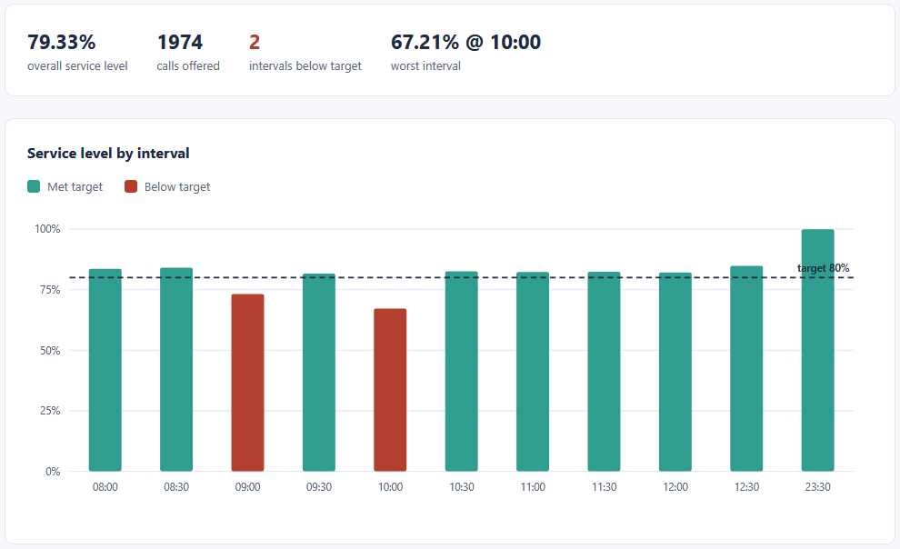
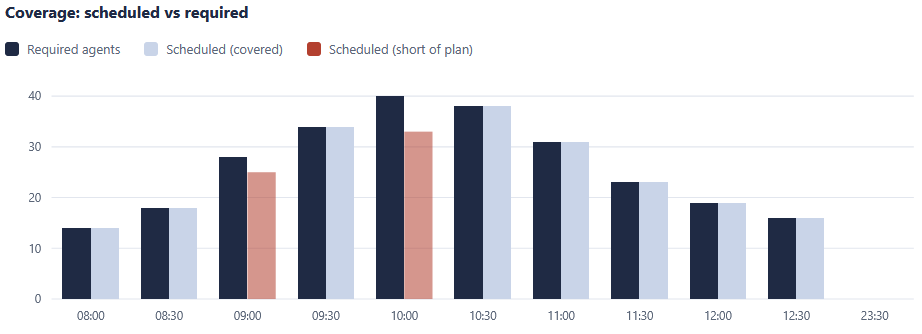
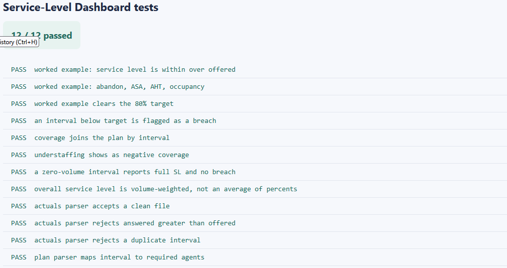
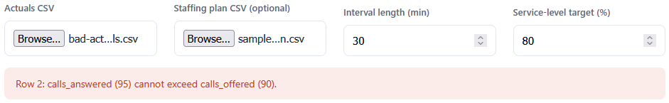

# Service-Level Dashboard

Reads a day of interval actuals and shows how each interval performed: service level, abandon rate,
average speed of answer, handle time, and occupancy. Load the staffing plan the Staffing Planner
exports and each interval is also checked against the agents it was meant to have, so understaffed
intervals stand out.

## How it works
A deterministic, rule-based tool. It reads the actuals with the browser's file reader, computes the
per-interval metrics, weights the overall service level by call volume, flags any interval below the
target, and draws a service-level timeline with a threshold line plus a coverage chart. The full
rules and a hand-checked example are in [spec.md](spec.md). It opens by double-clicking `index.html`,
runs entirely in your browser, and sends nothing anywhere.

The logic is written in TypeScript in `src/` and compiled to plain JavaScript in `dist/`, which is
what the page loads. The compiled files are included, so no build step is needed to run it. If you
edit the TypeScript, recompile with `npx -p typescript tsc -p tsconfig.json`.

## Running it
Open the tool:

- Double-click `index.html`, or serve the folder and open it in a browser.
- Click "Actuals CSV" and choose `sample-actuals.csv`.
- Optionally click "Staffing plan CSV" and choose `sample-staffing-plan.csv` to add coverage. This
  is the file the Staffing Planner exports.
- The charts, table, and summary fill in. Breach intervals are drawn in the breach colour and their
  table rows are highlighted.

Run the tests:

- Open `tests.html` in a browser. It runs the metrics logic against the assertions in
  `src/tests.ts` and prints PASS or FAIL for each, with a count at the top.

## In action

*Service level per interval with the target line, two breaches in the breach colour.*

*Scheduled against required agents, with the understaffed intervals flagged.*

*The test page with every case green.*

*Actuals where answered exceeds offered are refused, with the row named.*
