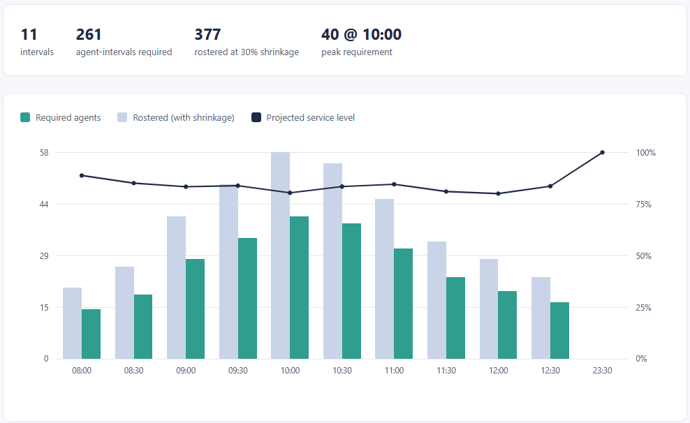
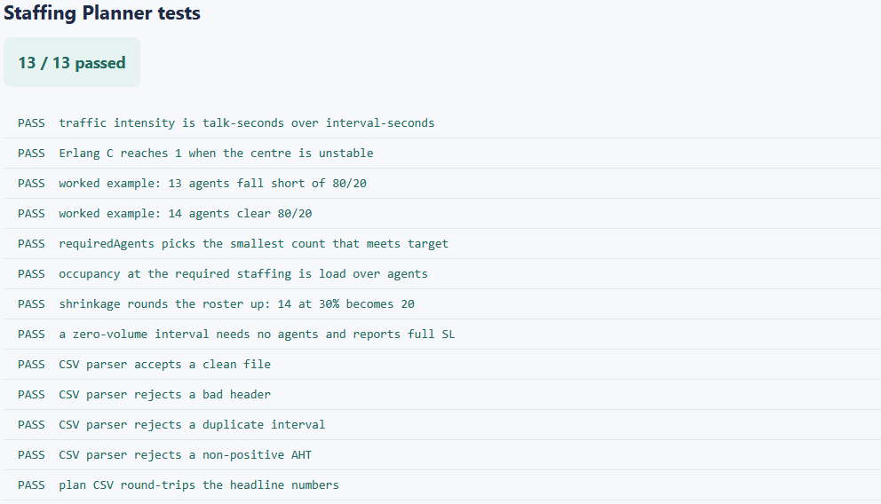
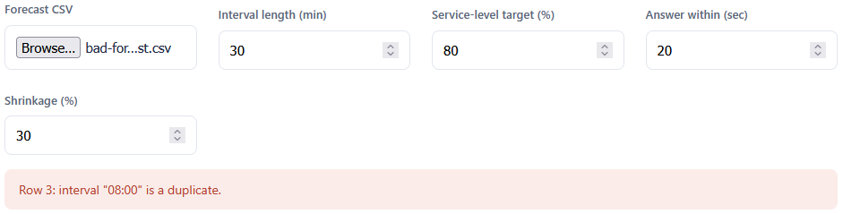

# Staffing Planner

Loads an interval call forecast and works out how many agents each interval needs to hit a
service-level target, using the Erlang C staffing model. The chart shows required and rostered
agents per interval with the projected service-level line, and the result exports as a CSV the
Service-Level Dashboard reads.

## How it works
A deterministic, rule-based tool. It reads the forecast with the browser's file reader, computes
traffic intensity in Erlangs, runs the Erlang B and Erlang C formulas to find the smallest agent
count that meets the target, adds shrinkage to get a roster, and draws the result. The full rules
and a hand-checked example are in [spec.md](spec.md). It opens by double-clicking `index.html`,
runs entirely in your browser, and sends nothing anywhere.

The logic is written in TypeScript in `src/` and compiled to plain JavaScript in `dist/`, which is
what the page loads. The compiled files are included, so no build step is needed to run it. If you
edit the TypeScript, recompile with `npx -p typescript tsc -p tsconfig.json`.

## Running it
Open the tool:

- Double-click `index.html`, or serve the folder and open it in a browser.
- Click "Forecast CSV" and choose `sample-forecast.csv`.
- The chart, table, and summary fill in. Adjust the target, answer-time, or shrinkage to redraw.
- Click "Export staffing-plan.csv" to save the plan for the dashboard.

Run the tests:

- Open `tests.html` in a browser. It runs the staffing logic against the assertions in
  `src/tests.ts` and prints PASS or FAIL for each, with a count at the top.

## In action

*Required and rostered agents per interval with the projected service-level line.*

*The test page with every case green.*

*A forecast with a duplicate interval is refused, with the row named.*
