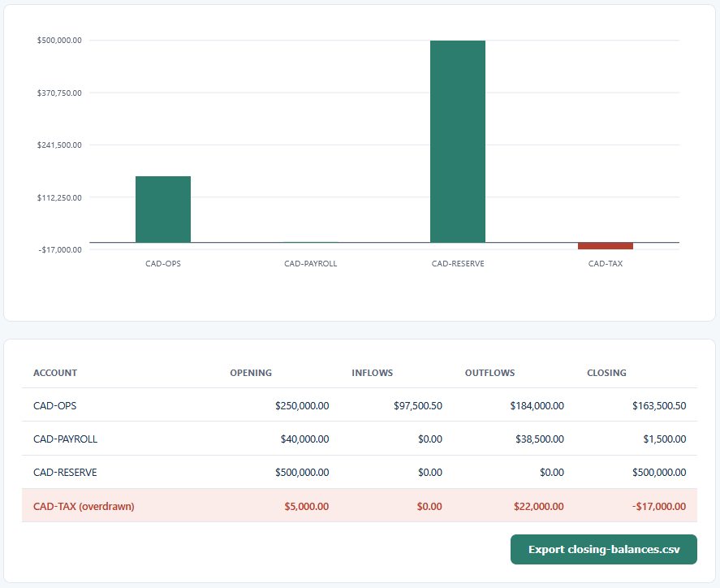
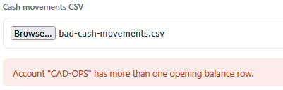

# Cash Position Dashboard

Loads a day's cash movements and builds the closing position for each bank account: opening
balance, inflows, outflows, and where each account ends the day, with a consolidated total.
Accounts that close below zero are flagged. The result exports as a CSV the Liquidity Forecast
reads.

## How it works
A deterministic, rule-based tool. It reads the movements with the browser's file reader, groups
them by account, sums inflows and outflows, and works out each closing balance, holding every
amount in integer cents so the totals are exact. The full rules and a hand-checked example are in
[spec.md](spec.md). It opens by double-clicking `index.html`, runs entirely in your browser, and
sends nothing anywhere.

The logic is written in TypeScript in `src/` and compiled to plain JavaScript in `dist/`, which is
what the page loads. The compiled files are included, so no build step is needed to run it. If you
edit the TypeScript, recompile with `npx -p typescript tsc -p tsconfig.json`.

## Running it
Open the tool:

- Double-click `index.html`, or serve the folder and open it in a browser.
- Click "Cash movements CSV" and choose `sample-cash-movements.csv`.
- The chart, table, and summary fill in. Overdrawn accounts show in the flag colour.
- Click "Export closing-balances.csv" to save the balances for the forecast.

Run the tests:

- Open `tests.html` in a browser. It runs the cash-position logic against the assertions in
  `src/tests.ts` and prints PASS or FAIL for each, with a count at the top.

## In action

*Each account's closing balance for the day, with the overdrawn CAD-TAX account flagged in red and the consolidated close at $648,000.50.*

*A movements file with a second opening row for one account is refused, with the account named.*
