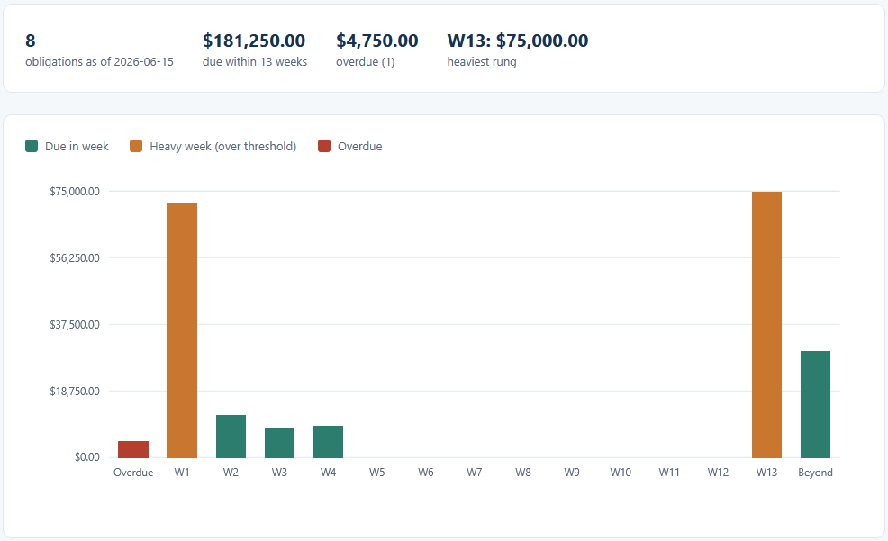
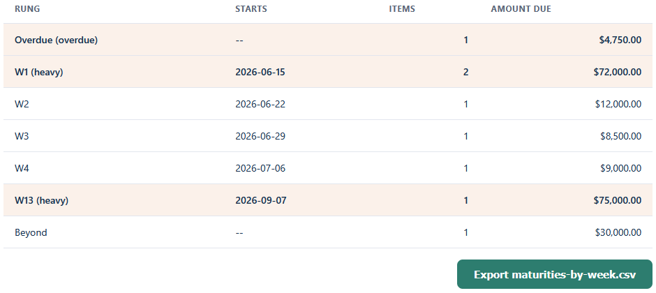

# Maturity Ladder

Loads a list of debts and obligations and sorts them into weekly rungs from an as-of date, so you
can see how much cash has to go out over the next 13 weeks. Past-due items show in their own rung,
weeks above a concentration threshold are flagged, and the weekly totals export as a CSV the
Liquidity Forecast reads.

## How it works
A deterministic, rule-based tool. It reads the obligations with the browser's file reader, measures
each due date against the as-of date, and buckets the amounts into weekly rungs, holding every
amount in integer cents so the totals are exact. The full rules and a hand-checked example are in
[spec.md](spec.md). It opens by double-clicking `index.html`, runs entirely in your browser, and
sends nothing anywhere.

The logic is written in TypeScript in `src/` and compiled to plain JavaScript in `dist/`, which is
what the page loads. The compiled files are included, so no build step is needed to run it. If you
edit the TypeScript, recompile with `npx -p typescript tsc -p tsconfig.json`.

## Running it
Open the tool:

- Double-click `index.html`, or serve the folder and open it in a browser.
- Click "Obligations CSV" and choose `sample-obligations.csv`.
- The ladder, table, and summary fill in. Adjust the as-of date or threshold to rebucket.
- Click "Export maturities-by-week.csv" to save the weekly totals for the forecast.

Run the tests:

- Open `tests.html` in a browser. It runs the ladder logic against the assertions in
  `src/tests.ts` and prints PASS or FAIL for each, with a count at the top.

## In action

*Obligations bucketed into weekly rungs from the as-of date, with the overdue rung in red and the weeks above the concentration threshold in the heavy colour.*

*The same ladder as a table: each rung's start date, item count, and amount due, with overdue and heavy rungs highlighted.*
