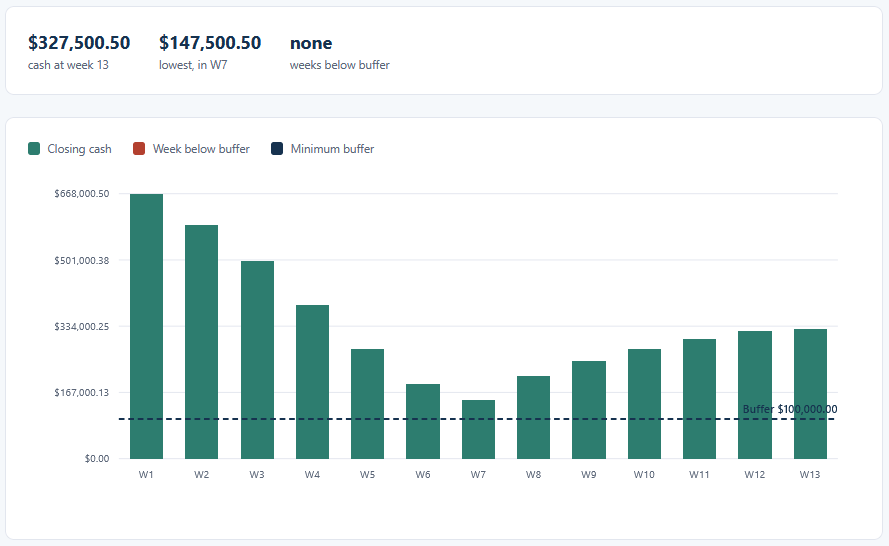
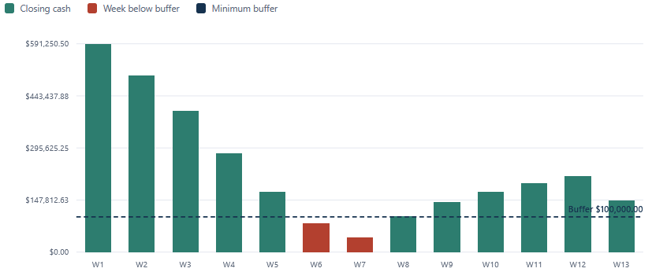
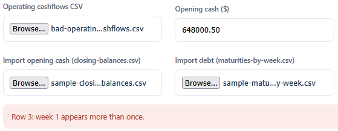

# Liquidity Forecast (13-Week)

Projects cash week by week over the next 13 weeks. It starts from opening cash, adds each week's
projected inflows, subtracts operating outflows and any debt coming due, carries the closing balance
forward, and flags any week that ends below a minimum-cash buffer. Opening cash can be imported from
the Cash Position Dashboard and debt from the Maturity Ladder, so all three line up on the same
numbers.

## How it works
A deterministic, rule-based tool. It reads the operating cashflows with the browser's file reader,
walks the 13 weeks in order carrying the closing balance forward, and compares each week against the
buffer, holding every amount in integer cents so the running balance is exact. The full rules and a
hand-checked example are in [spec.md](spec.md). It opens by double-clicking `index.html`, runs
entirely in your browser, and sends nothing anywhere.

The logic is written in TypeScript in `src/` and compiled to plain JavaScript in `dist/`, which is
what the page loads. The compiled files are included, so no build step is needed to run it. If you
edit the TypeScript, recompile with `npx -p typescript tsc -p tsconfig.json`.

## Running it
Open the tool:

- Double-click `index.html`, or serve the folder and open it in a browser.
- Click "Operating cashflows CSV" and choose `sample-operating-cashflows.csv`.
- The opening cash (648000.50) and buffer (100000.00) are prefilled for the sample. The chart,
  table, and summary fill in.
- To see the full wired result, click "Import opening cash" and choose `sample-closing-balances.csv`,
  then "Import debt" and choose `sample-maturities-by-week.csv`. These are the exact files the Cash
  Position Dashboard and the Maturity Ladder export for the shared sample. Weeks 6 and 7 turn red as
  the cash dips below the buffer.
- Click "Export forecast.csv" to save the projection.

Run the tests:

- Open `tests.html` in a browser. It runs the forecast logic against the assertions in
  `src/tests.ts` and prints PASS or FAIL for each, with a count at the top.

## In action

*Closing cash across the 13 weeks from operating flows only. Every week stays above the buffer.*

*After importing the dashboard's closing balances and the ladder's maturities, weeks 6 and 7 fall below the $100,000.00 buffer and turn red.*

*An operating file that repeats week 1 is refused, with the row and week named.*
