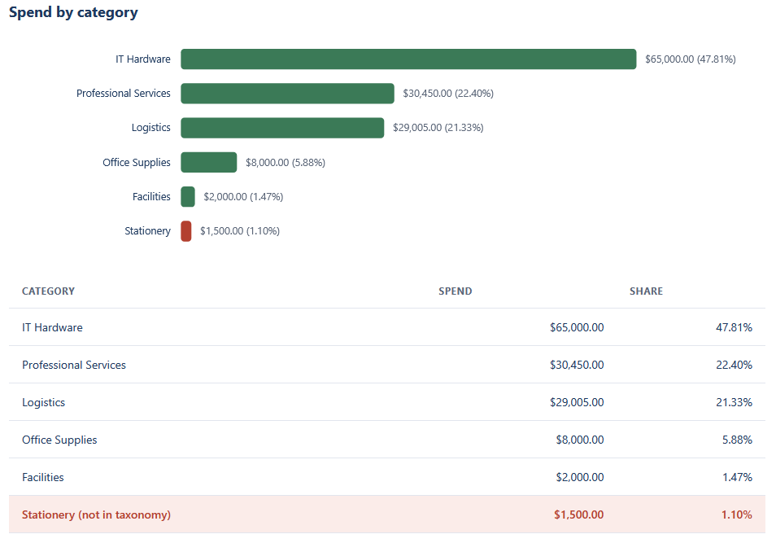
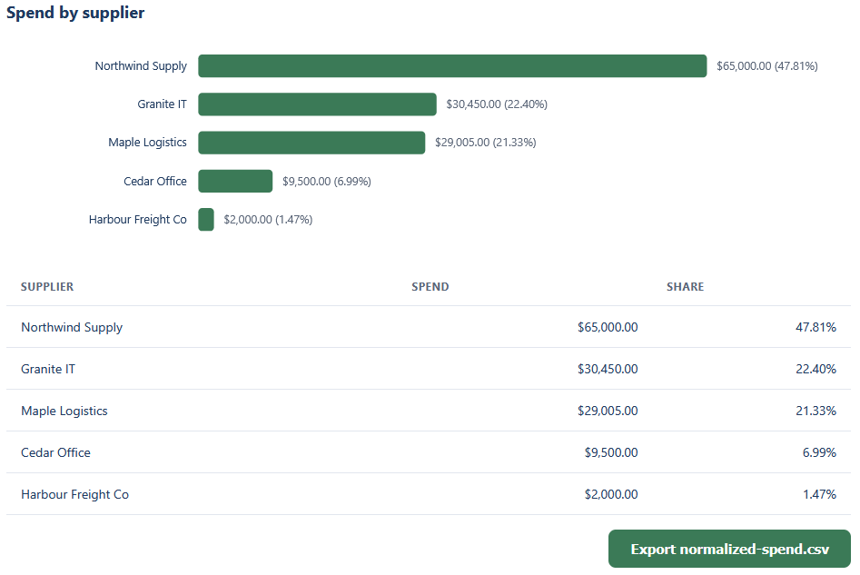
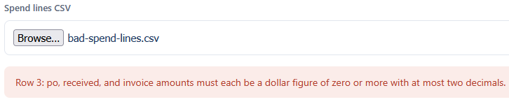

# Spend Analysis Dashboard

Load a list of procurement spend lines and see the total spend broken down by category and by
supplier, with each share of the total. It is the first of the three views in this repo and the
one that feeds the other two.

## How it works
The dashboard is deterministic and rule-based, with the full rules written out in [spec.md](spec.md).
It validates and cleans every spend line, totals the invoice amounts, and groups them by category
and by supplier. Money is held in integer cents so the totals are exact. Rows that cannot be
analyzed are skipped with a note, and a line whose category is not in the taxonomy is kept but
flagged for review. The clean lines are written to a `normalized-spend.csv` that the Supplier
Pareto and the PO/Invoice Compliance views read.

The logic lives in TypeScript under `src/` and is compiled to plain JavaScript in `dist/`, which
the page loads directly. It is a browser tool: it opens by double-clicking `index.html`, with no
framework, no build step, and no server. Everything stays on your machine, nothing is uploaded.

## Running it
Open the dashboard:

- Double-click `index.html`.
- Choose `sample-spend-lines.csv` with the file picker.
- The tiles, the two charts, the two tables, and the review notes fill in. Click
  **Export normalized-spend.csv** to save the file the other two views read.

Try the rejection path by choosing `bad-spend-lines.csv`. It has a non-numeric invoice amount on
one row, so the dashboard refuses the file and explains why instead of showing wrong numbers.

Run the tests:

- Double-click `tests.html`. It loads the same logic the dashboard uses, runs the checks, and
  prints a green PASS line for each, with a count at the top.

To rebuild the JavaScript after editing anything under `src/` (Node and TypeScript installed):

```
npx -p typescript tsc
```

## In action

Spend broken down by category, with the share of total spend on each bar. The Stationery line
sits outside the taxonomy, so it is flagged.



The same total broken down by supplier, largest first, with the button that exports the
normalized file the other two views read.



A file with a non-numeric invoice amount is refused, with the row and the reason named.


