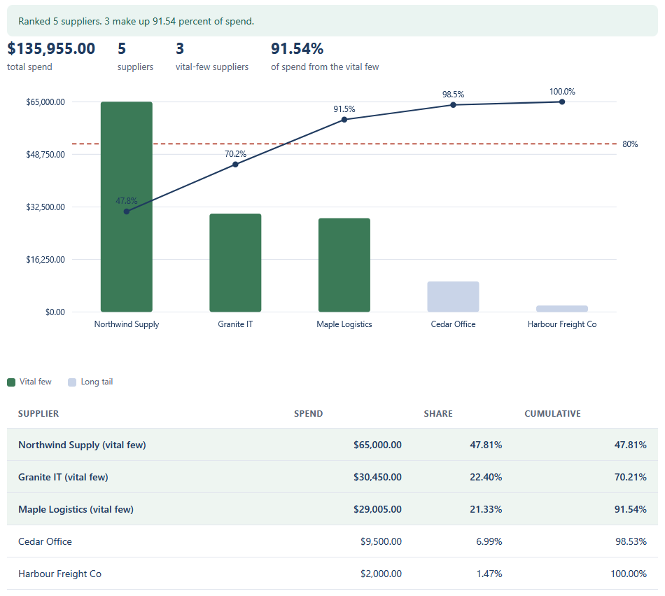
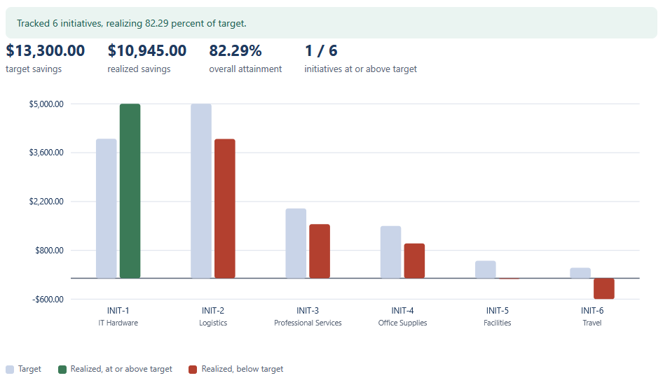
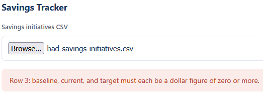

# Supplier Pareto and Savings Tracker

Two views over the spend. The Supplier Pareto ranks suppliers from largest to smallest and marks
the vital few that make up the first 80 percent of spend. The Savings Tracker compares realized
savings against target across a list of cost initiatives.

## How it works
Both views are deterministic and rule-based, with the full rules written out in [spec.md](spec.md).
The Pareto reads the `normalized-spend.csv` the Spend Analysis Dashboard exports, totals spend by
supplier, sorts high to low, and walks the running cumulative share to find the vital few at the
80 percent cut. The Savings Tracker works out realized savings as baseline minus current and
compares it to target. Money is held in integer cents so the totals match the dashboard to the
cent.

The logic lives in TypeScript under `src/` and is compiled to plain JavaScript in `dist/`, which
the page loads directly. It is a browser tool: it opens by double-clicking `index.html`, with no
framework, no build step, and no server. Everything stays on your machine, nothing is uploaded.

## Running it
Open the views:

- Double-click `index.html`.
- For the Supplier Pareto, choose `sample-normalized-spend.csv`. This is the file the Spend
  Analysis Dashboard exports, so the Pareto picks up exactly where the dashboard leaves off. The
  chart, the cumulative line, and the table fill in, with the vital few highlighted.
- For the Savings Tracker, choose `sample-savings-initiatives.csv`. The target-versus-realized
  chart and the attainment table fill in, with any review notes below.

Try the rejection path by choosing `bad-savings-initiatives.csv` for the Savings Tracker. It has a
non-numeric target on one row, so the tracker refuses the file and explains why.

Run the tests:

- Double-click `tests.html`. It loads the same logic the views use, runs the checks, and prints a
  green PASS line for each, with a count at the top.

To rebuild the JavaScript after editing anything under `src/` (Node and TypeScript installed):

```
npx -p typescript tsc
```

## In action

Suppliers ranked by spend with the cumulative-share line over them. The running share crosses the
80 percent cut at the third supplier, so three of the five are the vital few.



Target against realized savings per initiative. INIT-1 beats target, INIT-6 is an overrun below
the line, and the overall attainment reads 82.29 percent.



A savings file with a non-numeric target is refused, with the row and the reason named.


