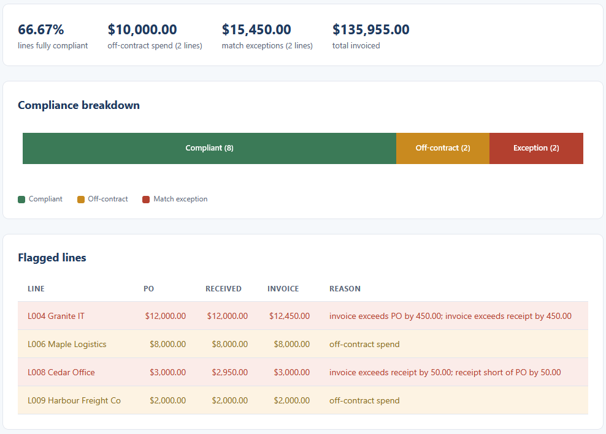
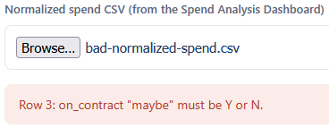

# PO/Invoice Compliance

Load the normalized spend file the Spend Analysis Dashboard exports and check every line against
two rules: spend should sit on a contract, and the purchase order, the goods receipt, and the
invoice should agree within tolerance. Lines that fail are flagged with the reason and the amount.

## How it works
The check is deterministic and rule-based, with the full rules written out in [spec.md](spec.md).
Each line is judged two ways: off-contract when its on_contract flag is N, and a three-way-match
exception when the PO, receipt, and invoice differ by more than the tolerance, which is the
greater of 5.00 dollars or 1 percent of the PO. Money is held in integer cents, so the total
invoiced matches the dashboard to the cent.

The logic lives in TypeScript under `src/` and is compiled to plain JavaScript in `dist/`, which
the page loads directly. It is a browser tool: it opens by double-clicking `index.html`, with no
framework, no build step, and no server. Everything stays on your machine, nothing is uploaded.

## Running it
Open the view:

- Double-click `index.html`.
- Choose `sample-normalized-spend.csv`, the file the Spend Analysis Dashboard exports. The tiles,
  the breakdown bar, and the flagged-lines table fill in, showing the off-contract spend and the
  three-way-match exceptions with their reasons.

Try the rejection path by choosing `bad-normalized-spend.csv`. It has an on_contract value that is
not Y or N on one row, so the view refuses the file and explains why.

Run the tests:

- Double-click `tests.html`. It loads the same logic the view uses, runs the checks, and prints a
  green PASS line for each, with a count at the top.

To rebuild the JavaScript after editing anything under `src/` (Node and TypeScript installed):

```
npx -p typescript tsc
```

## In action

The compliance summary, the breakdown bar split into compliant, off-contract, and exception, and
the flagged-lines table with the reason and the amounts behind each flag.



A file with an on_contract value that is not Y or N is refused, with the row and the reason named.


