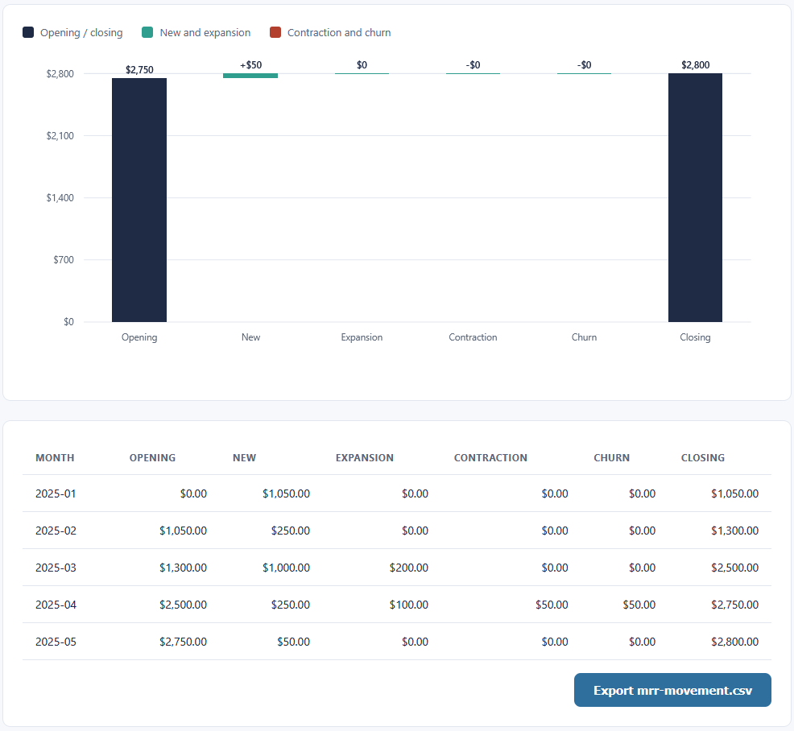

# MRR Movement Waterfall

Loads a monthly recurring-revenue ledger and shows how the recurring revenue base moves from one
month to the next: opening, new, expansion, contraction, churn, and closing. It is the first of
three connected visualizations, and the movement table it exports feeds the churn and renewal
dashboard.

## How it works
The tool is deterministic and rule-based, with the full rules in [spec.md](spec.md). It rolls
each month forward from the one before it and classifies every customer as new, expanded,
contracted, or churned, so closing MRR always reconciles to opening MRR. The logic lives in
TypeScript under `src/`, compiled to plain JavaScript in `dist/`. The page loads the compiled
JavaScript, so it opens by double-clicking `index.html` with no build step and no server. All
money is held in integer cents so the totals stay exact, and everything runs on your machine.

The columns of the calculation stay separate: `src/movement.ts` holds the pure logic with no page
access, `src/ui.ts` wires the page to that logic and draws the waterfall, and `index.html` holds
the markup. The test page imports the logic file directly.

## Running it
Open the tool:

- Double-click `index.html`.
- Click **Ledger CSV** and choose `sample-ledger.csv`.
- The waterfall defaults to the latest month. Pick another month from the dropdown, tick **Show
  ARR** to switch to the annual view, and click **Export mrr-movement.csv** to save the table the
  dashboard reads.

Run the tests:

- Double-click `tests.html`. Each check prints PASS or FAIL and the banner shows the total.

Rebuild the JavaScript after editing the TypeScript (optional, the compiled files are committed):

```
npx -p typescript tsc
```

## In action



The movement table for the full sample ledger, with the waterfall above it. Opening, new, expansion, contraction, churn, and closing reconcile every month, closing at $2,800.00.
