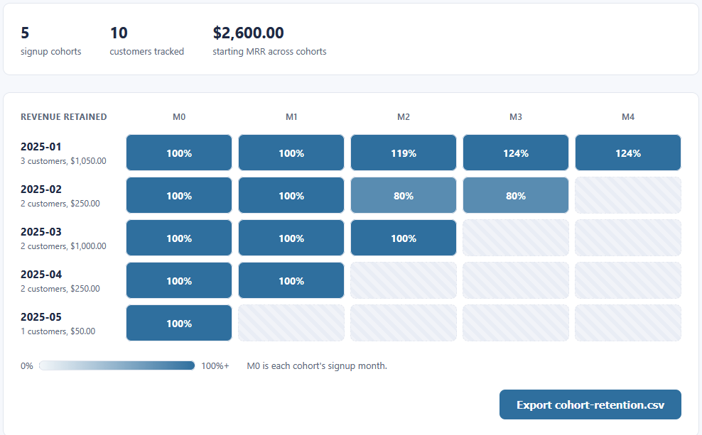

# Cohort Retention Heatmap

Groups customers by their signup month and shows how much of each cohort stays over the following
months, as a heatmap. Read it as revenue retained or as customers retained. It is the second of
three connected visualizations and reads the same ledger as the MRR Movement Waterfall.

## How it works
The tool is deterministic and rule-based, with the full rules in [spec.md](spec.md). Each cohort
is measured against its own starting month, so a cell is the share of that cohort's starting
revenue or starting customer count still active that month. The logic lives in TypeScript under
`src/`, compiled to plain JavaScript in `dist/`. The page loads the compiled JavaScript, so it
opens by double-clicking `index.html` with no build step and no server. All money is held in
integer cents so the totals stay exact, and everything runs on your machine.

The columns of the calculation stay separate: `src/cohort.ts` holds the pure logic with no page
access, `src/ui.ts` wires the page to that logic and draws the heatmap, and `index.html` holds
the markup. The test page imports the logic file directly.

## Running it
Open the tool:

- Double-click `index.html`.
- Click **Ledger CSV** and choose `sample-ledger.csv`.
- Switch **Measure** between revenue retention and logo retention. Hover any cell for the exact
  figures, and click **Export cohort-retention.csv** to save the table.

Run the tests:

- Double-click `tests.html`. Each check prints PASS or FAIL and the banner shows the total.

Rebuild the JavaScript after editing the TypeScript (optional, the compiled files are committed):

```
npx -p typescript tsc
```

## In action



Revenue retention by cohort. Each row is a signup month, each column the months since signup. Darker cells held more of their starting base, and a cell above 100% means the cohort grew, like the January cohort reaching 124%.
