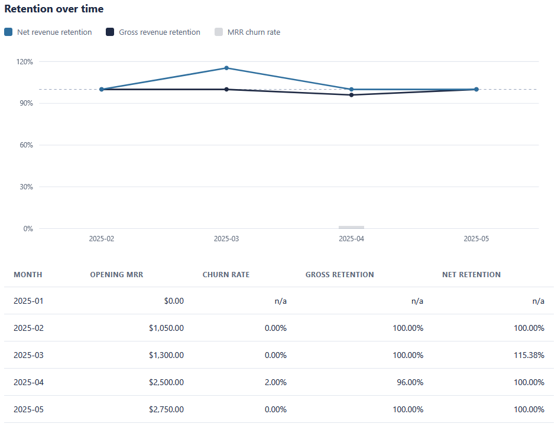
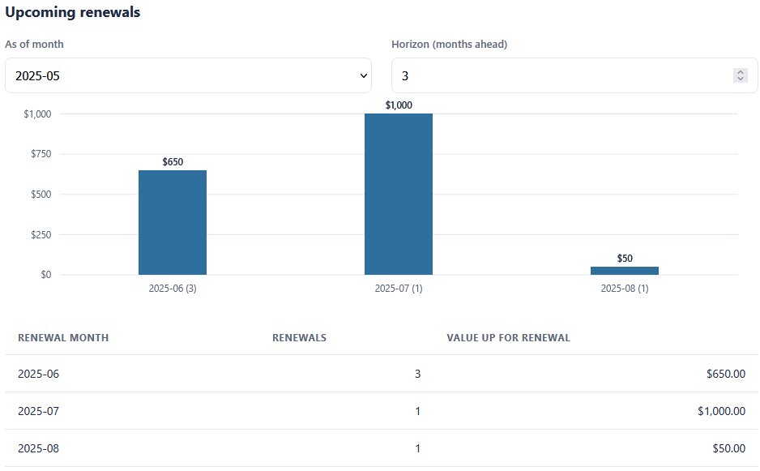
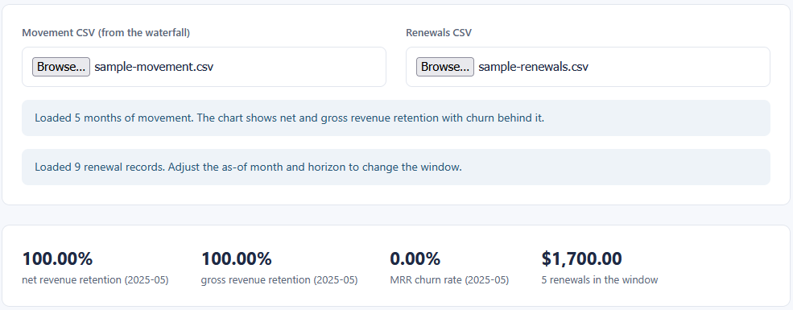

# Churn and Renewal Dashboard

Reads the movement table the MRR Movement Waterfall exports and reports the retention metrics an
analyst tracks each month: the MRR churn rate, gross revenue retention, and net revenue retention.
With a renewals file it also shows the contracts coming up for renewal. It is the third of three
connected visualizations, and it consumes the first tool's output.

## How it works
The tool is deterministic and rule-based, with the full rules in [spec.md](spec.md). It checks
that the movement file reconciles before reporting anything off it, then derives churn and
retention straight from the movement components, so its numbers tie back to the waterfall to the
cent. The logic lives in TypeScript under `src/`, compiled to plain JavaScript in `dist/`. The
page loads the compiled JavaScript, so it opens by double-clicking `index.html` with no build step
and no server. All money is held in integer cents so the totals stay exact, and everything runs on
your machine.

The columns of the calculation stay separate: `src/retention.ts` holds the pure logic with no page
access, `src/ui.ts` wires the page to that logic and draws the charts, and `index.html` holds the
markup. The test page imports the logic file directly.

## Running it
Open the tool:

- Double-click `index.html`.
- Click **Movement CSV** and choose `sample-movement.csv` (this is the file the waterfall exports;
  you can also export your own from the first tool and load it here).
- Click **Renewals CSV** and choose `sample-renewals.csv`.
- Adjust **As of month** and **Horizon** to change the renewal window.

Run the tests:

- Double-click `tests.html`. Each check prints PASS or FAIL and the banner shows the total.

Rebuild the JavaScript after editing the TypeScript (optional, the compiled files are committed):

```
npx -p typescript tsc
```

## In action



Net and gross revenue retention each month against the 100% line, with the table below. April shows a 2.00% churn rate, 96.00% gross retention, and 100.00% net retention, the same figures the waterfall's April row produces.



Contracts coming up for renewal in the three months after the as-of month, grouped by month: $650.00 across three renewals in June, $1,000.00 in July, and $50.00 in August.



The headline metrics after loading the movement and renewals files: net and gross revenue retention, the MRR churn rate, and the value up for renewal in the window.
