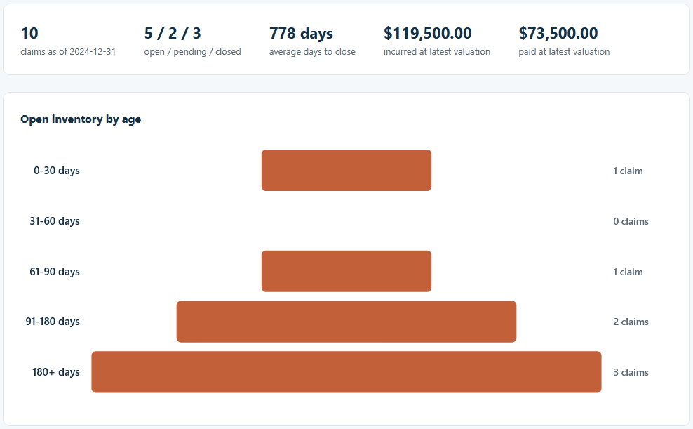
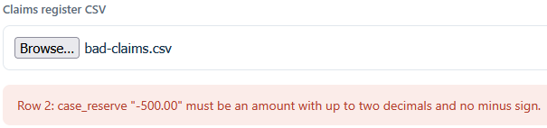

# Claims Aging and Status Funnel

Load a claims valuation register and see how the open book ages, how the open, pending, and
closed counts break down, and how long closed claims took to settle. This is the first of three
connected tools, and it produces the clean claims file the other two read.

## How it works
The tool rolls each claim up to its latest valuation, then buckets the still-open inventory by
age since the report date (0-30, 31-60, 61-90, 91-180, 180+ days), counts the status mix, and
averages the days to close over the closed claims. It is deterministic and rule-based, with every
rule and the full list of validation checks written out in [spec.md](spec.md). Money is held in
integer cents so totals stay exact. It is a browser tool in plain HTML, CSS, and TypeScript
compiled to JavaScript: it opens by double-clicking `index.html`, with no framework, no build
step, and no server, and every file you load stays on your machine.

## Running it
1. Open `index.html` by double-clicking it.
2. Choose `sample-claims.csv` with the file picker. The aging funnel, the status mix, and the
   totals fill in.
3. Click **Export clean-claims.csv** to save the file the Loss Ratio Dashboard and the Reserve
   Development Triangle read.
4. To see the checks run, open `tests.html` the same way. It prints PASS or FAIL for each case.
5. To see a rejection, load `bad-claims.csv`. The tool refuses it and names the problem.

If you change `src/aging.ts`, `src/ui.ts`, or `src/tests.ts`, recompile with `npx -p typescript
tsc` from this folder to refresh the files in `dist/`.

## In action

Ten claims as of 2024-12-31: a 5 / 2 / 3 open, pending, and closed split, 778 days average to
close, and CAD 119,500.00 incurred. The open inventory widens toward the older buckets, with three
claims past 180 days.

Loading `bad-claims.csv` stops at the first bad value and names it: a case reserve cannot be
negative.
