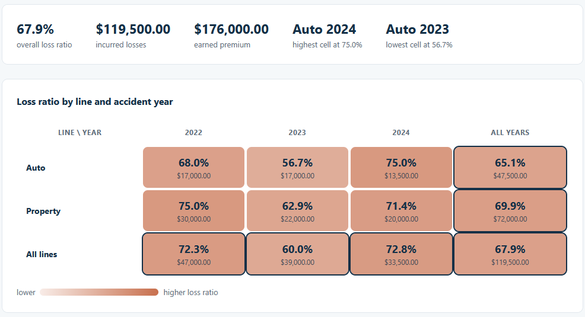
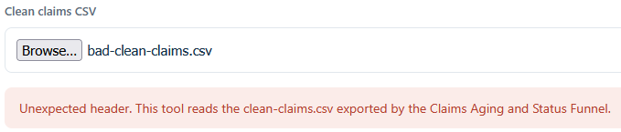

# Loss Ratio Dashboard

Read the clean claims file from the Claims Aging and Status Funnel and see the loss ratio,
incurred losses over earned premium, for every line of business and accident year. This is the
second of three connected tools.

## How it works
The dashboard keeps each claim's latest valuation, groups by line of business and accident year,
sums the incurred losses, takes the earned premium once per line and year, and divides to get the
loss ratio for every cell, line, year, and the book overall. It is deterministic and rule-based,
with every rule and validation check written out in [spec.md](spec.md). Money is held in integer
cents so the totals match the funnel to the cent. It is a browser tool in plain HTML, CSS, and
TypeScript compiled to JavaScript: it opens by double-clicking `index.html`, with no framework,
no build step, and no server, and every file you load stays on your machine.

## Running it
1. Open `index.html` by double-clicking it.
2. Choose `sample-clean-claims.csv` with the file picker. This file is the Claims Aging and
   Status Funnel's export; you can also produce your own there and load it here. The grid and the
   summary fill in.
3. To see the checks run, open `tests.html` the same way. It prints PASS or FAIL for each case.
4. To see a rejection, load `bad-clean-claims.csv`. It is the raw register rather than the clean
   export, so the tool refuses it and points you back to the funnel.

If you change `src/lossratio.ts`, `src/ui.ts`, or `src/tests.ts`, recompile with `npx -p
typescript tsc` from this folder to refresh the files in `dist/`.

## In action

Loss ratio by line and accident year, shaded deeper as the ratio climbs. Auto 2022 runs at 68.0
percent, and the whole book sits at 67.9 percent, CAD 119,500.00 incurred over CAD 176,000.00 of
earned premium.

Loading the raw register instead of the clean export is caught by the header check, which points
back to the Claims Aging and Status Funnel.
