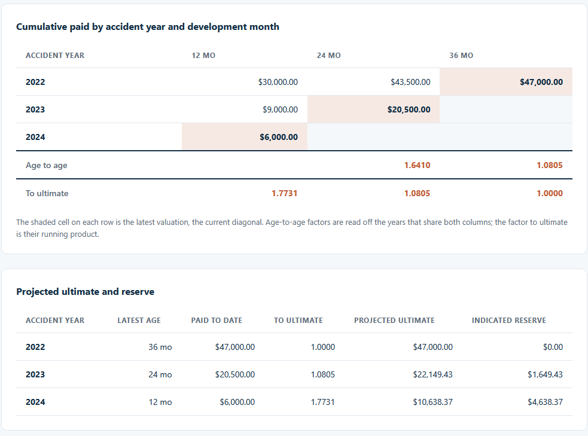
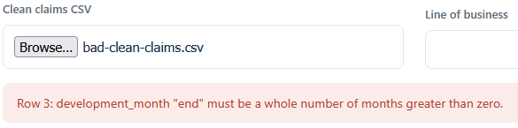

# Reserve Development Triangle

Read the clean claims file from the Claims Aging and Status Funnel and lay cumulative paid losses
out as a development triangle, with the age-to-age factors and a projected ultimate and reserve
for each accident year. This is the third of three connected tools.

## How it works
The tool pivots cumulative paid losses into a triangle of accident year by development month,
reads the age-to-age factors off the overlapping diagonals, chains them into a factor to ultimate
for each age, and projects each accident year from its latest valuation. It is deterministic and
rule-based, with every rule written out in [spec.md](spec.md). Money is held in integer cents and
factors are shown to four decimals, so the paid figures match the funnel to the cent. It is a
browser tool in plain HTML, CSS, and TypeScript compiled to JavaScript: it opens by
double-clicking `index.html`, with no framework, no build step, and no server, and every file you
load stays on your machine.

## Running it
1. Open `index.html` by double-clicking it.
2. Choose `sample-clean-claims.csv` with the file picker. This file is the Claims Aging and
   Status Funnel's export; you can also produce your own there and load it here. The triangle, the
   factors, and the projections fill in.
3. Use the line-of-business picker to rebuild the triangle for one line, or leave it on All.
4. To see the checks run, open `tests.html` the same way. It prints PASS or FAIL for each case.
5. To see a rejection, load `bad-clean-claims.csv`. One row has a development month of "end"
   instead of a number, so the tool refuses it and names the problem.

If you change `src/triangle.ts`, `src/ui.ts`, or `src/tests.ts`, recompile with `npx -p
typescript tsc` from this folder to refresh the files in `dist/`.

## In action

Cumulative paid by accident year and development month, with the latest valuation shaded on each
row. The age-to-age factors are 1.6410 and 1.0805, so a claim at 12 months develops to ultimate by
1.7731. The projection table carries each accident year out to ultimate and its indicated reserve.

Loading `bad-clean-claims.csv` stops on the row whose development month reads "end" instead of a
number.
