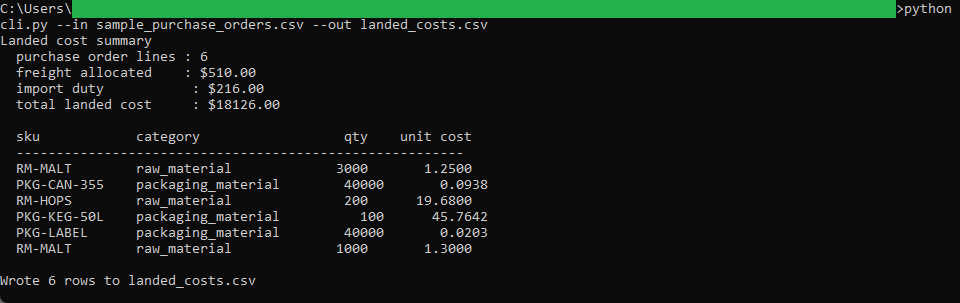
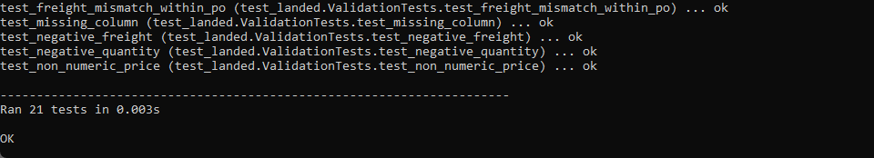
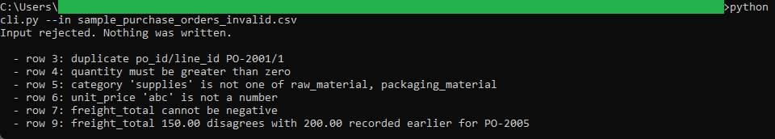

# Procurement Landed Cost

A command-line tool that turns raw material and packaging purchase orders into a
landed cost per line, folding freight and Canadian import duty into the price
paid. It is the first tool in the pipeline: it writes the landed costs that the
batch costing and inventory valuation tools read.

## How it works
The tool is deterministic and rule-based, with the full rules in [spec.md](spec.md).
It groups purchase-order lines by order, spreads each order's freight bill across
its lines by extended value using the largest-remainder method so the cents sum
exactly, charges import duty per line as a percent of value, and divides the
landed total by quantity for a landed unit cost. It is command-line Python using
the standard library only, no framework and no install, and it reads and writes
plain CSV files on your machine.

Money is carried as `decimal.Decimal` and rounded half up to the cent, so the
landed costs agree to the cent with the tools downstream.

## Running it
From this folder:

```
cd "C:\Users\jebo\Documents\Claude Code Projects\exekyute-daily-builds\job-modeled-toolkits\21-craft-brewery-cost-accounting-toolkit\01-procurement-landed-cost"
```

Run the test suite:

```
python -m unittest -v
```

Cost the sample purchase orders and write the output CSV:

```
python cli.py --in sample_purchase_orders.csv --out landed_costs.csv
```

See the validation reject a bad file (nothing is written):

```
python cli.py --in sample_purchase_orders_invalid.csv
```

## In action


Freight and import duty folded into each line, totalling $18,126.00 of landed cost.


All 21 unit tests pass.


A bad purchase-order file is rejected with one message per problem, and nothing is written.
