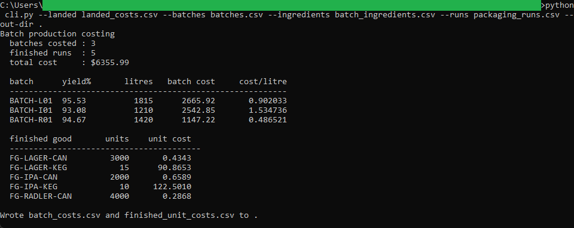
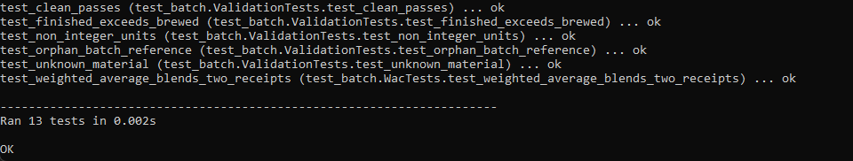
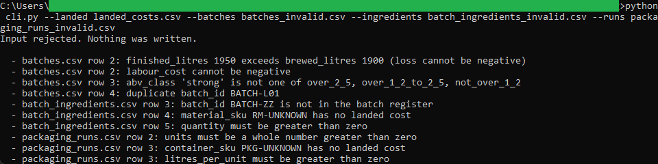

# Batch Production Costing

A command-line tool that rolls materials, packaging, labour, and overhead into
the cost of each brew batch, absorbs yield loss into the good beer, and works out
the cost of every finished can and keg. It reads the landed costs from the
procurement tool and writes the batch and finished-unit costs that the excise,
valuation, and margin tools use.

## How it works
The tool is deterministic and rule-based, with the full rules in [spec.md](spec.md).
It derives a weighted-average landed cost per material, costs each batch's
ingredients at that cost, adds labour and overhead, then spreads the brew cost
across packaging runs by volume so the finished-unit costs sum back to the batch
cost to the cent. It is command-line Python using the standard library only, no
framework and no install, reading and writing plain CSV files on your machine.

Money is carried as `decimal.Decimal` and rounded half up to the cent, so the
batch costs agree to the cent with the tools downstream.

## Running it
From this folder:

```
cd "C:\Users\jebo\Documents\Claude Code Projects\exekyute-daily-builds\job-modeled-toolkits\21-craft-brewery-cost-accounting-toolkit\02-batch-production-costing"
```

Run the test suite:

```
python -m unittest -v
```

Cost the sample batches and write the output CSVs:

```
python cli.py --landed landed_costs.csv --batches batches.csv --ingredients batch_ingredients.csv --runs packaging_runs.csv --out-dir .
```

See the validation reject a bad input set (nothing is written):

```
python cli.py --landed landed_costs.csv --batches batches_invalid.csv --ingredients batch_ingredients_invalid.csv --runs packaging_runs_invalid.csv
```

## In action


Three batches costed to $6,355.99, with the per-batch yield and the cost of every finished can and keg.


All 13 unit tests pass.


A bad input set is rejected, naming each problem across the three files, and nothing is written.
