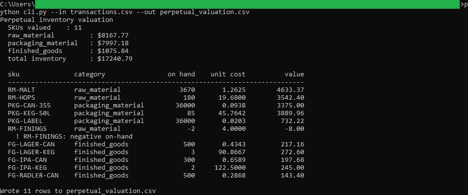
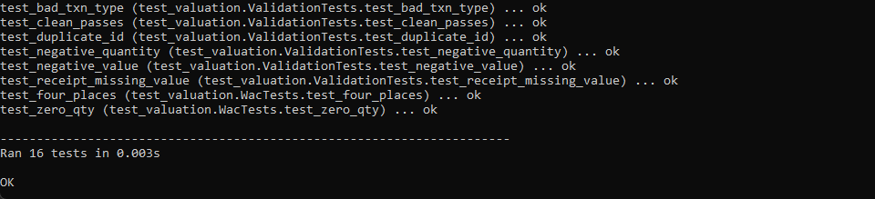
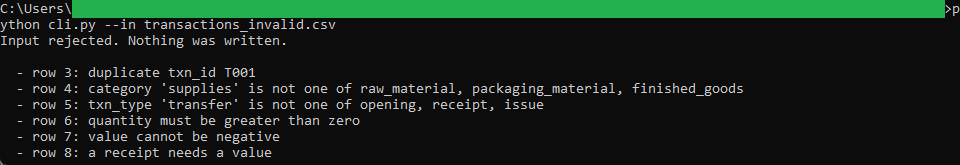

# Perpetual Inventory Valuation

A command-line tool that keeps a perpetual weighted-average ledger across raw
materials, packaging, and finished goods, and reports the on-hand quantity, unit
cost, and value of every SKU at period end. It reads a transaction ledger fed by
the procurement and batch tools and writes the book inventory the month-end close
reconciles against the physical count.

## How it works
The tool is deterministic and rule-based, with the full rules in [spec.md](spec.md).
It replays each SKU's movements in order under the perpetual weighted-average
method: receipts re-average the unit cost, issues draw down at that cost, and an
over-issue is flagged rather than hidden. It is command-line Python using the
standard library only, no framework and no install, reading and writing plain CSV
files on your machine.

Money is carried as `decimal.Decimal` and rounded half up to the cent, so the
ending values agree to the cent with the month-end close.

## Running it
From this folder:

```
cd "C:\Users\jebo\Documents\Claude Code Projects\exekyute-daily-builds\job-modeled-toolkits\21-craft-brewery-cost-accounting-toolkit\03-perpetual-inventory-valuation"
```

Run the test suite:

```
python -m unittest -v
```

Value the sample ledger and write the output CSV:

```
python cli.py --in transactions.csv --out perpetual_valuation.csv
```

See the validation reject a bad ledger (nothing is written):

```
python cli.py --in transactions_invalid.csv
```

## In action


Total inventory of $17,240.79 by category, with the RM-FININGS over-issue flagged as negative on-hand.


All 16 unit tests pass.


A bad ledger is rejected with one message per problem, and nothing is written.
