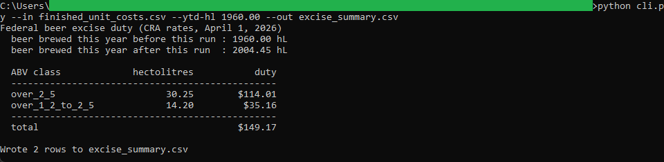
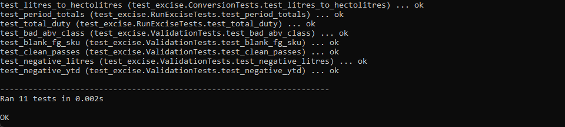
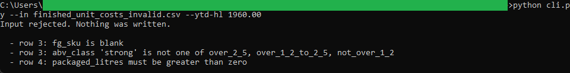

# Excise Duty Engine

A command-line tool that computes the federal excise duty on packaged beer using
the Canada Revenue Agency reduced-rate brackets by ABV class. It reads the
packaged volumes from the batch tool and writes the duty by ABV class for the
margin tool and the month-end close.

## How it works
The tool is deterministic and rule-based, with the full rules and the CRA rate
table in [spec.md](spec.md) and `excise.py`. It converts litres to hectolitres,
threads a running annual production figure through the packaging runs so each
volume lands in the right bracket, and splits any volume that spans a boundary.
It is command-line Python using the standard library only, no framework and no
install, reading and writing plain CSV files on your machine.

Duty is carried as `decimal.Decimal` and rounded half up to the cent, so the
figure agrees with the month-end close.

## Running it
From this folder:

```
cd "C:\Users\jebo\Documents\Claude Code Projects\exekyute-daily-builds\job-modeled-toolkits\21-craft-brewery-cost-accounting-toolkit\04-excise-duty-engine"
```

Run the test suite:

```
python -m unittest -v
```

Compute the duty on the sample volumes and write the output CSV:

```
python cli.py --in finished_unit_costs.csv --ytd-hl 1960.00 --out excise_summary.csv
```

See the validation reject a bad file (nothing is written):

```
python cli.py --in finished_unit_costs_invalid.csv --ytd-hl 1960.00
```

## In action


The period's packaged volume threaded through the CRA brackets, totalling $149.17 of duty.


All 11 unit tests pass.


A bad file is rejected with one message per problem, and nothing is written.
