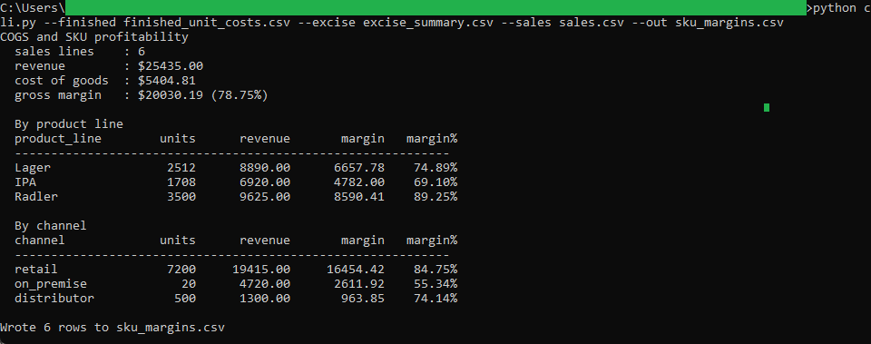
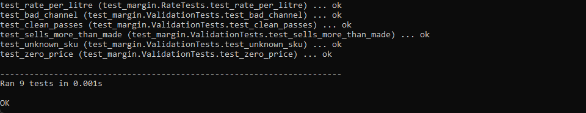
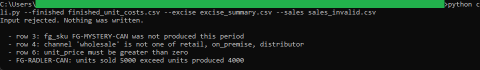

# COGS and SKU Profitability

A command-line tool that combines production cost and excise duty into a cost of
goods sold for every sales line, then reports revenue and gross margin by SKU,
product line, and channel. It reads the batch tool's finished-unit costs, the
excise tool's duty, and a sales file, and writes the per-SKU margins for the
month-end close and the dashboard.

## How it works
The tool is deterministic and rule-based, with the full rules in [spec.md](spec.md).
It derives an excise rate per litre by ABV class, adds it to each unit's
production cost, and works gross margin out line by line before rolling up by
product line and channel. It is command-line Python using the standard library
only, no framework and no install, reading and writing plain CSV files on your
machine.

Money is carried as `decimal.Decimal` and rounded half up to the cent, so the
figures agree with the rest of the pipeline.

## Running it
From this folder:

```
cd "C:\Users\jebo\Documents\Claude Code Projects\exekyute-daily-builds\job-modeled-toolkits\21-craft-brewery-cost-accounting-toolkit\05-cogs-sku-profitability"
```

Run the test suite:

```
python -m unittest -v
```

Cost the sample sales and write the output CSV:

```
python cli.py --finished finished_unit_costs.csv --excise excise_summary.csv --sales sales.csv --out sku_margins.csv
```

See the validation reject a bad sales file (nothing is written):

```
python cli.py --finished finished_unit_costs.csv --excise excise_summary.csv --sales sales_invalid.csv
```

## In action


Revenue of $25,435.00 and gross margin of $20,030.19, rolled up by product line and channel.


All 9 unit tests pass.


A bad sales file is rejected, including a SKU that was not produced and a quantity that exceeds production.
