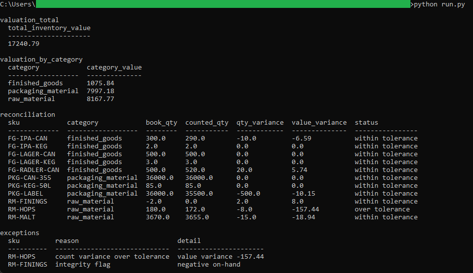
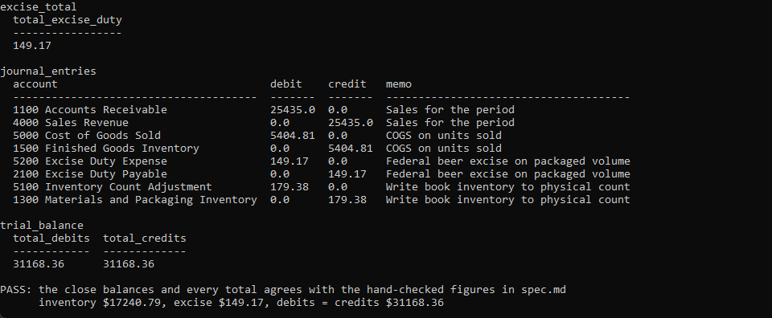
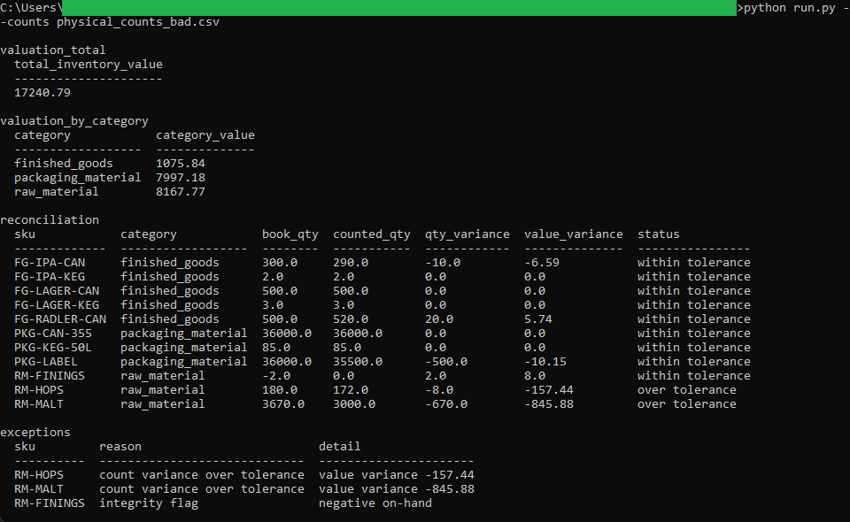

# Month-End Close

A SQL tool that reconciles the book inventory against the physical count, flags
the variances worth attention, generates the closing journal entries, and proves
the books balance. It reads the CSVs the upstream tools wrote and is the tool
that ties the pipeline together: its valuation total matches the perpetual
valuation tool and its excise total matches the excise duty engine, to the cent.

## How it works
The tool is deterministic and rule-based, with the full rules in [spec.md](spec.md).
The schema and the analytical queries live in plain `.sql` files; a thin Python
runner builds an in-memory SQLite database, loads the sample CSVs, runs each
query, prints the results, and checks every total against the hand-checked
figures. It runs entirely on your machine with the standard library, no database
server and no install. Money is checked with `decimal.Decimal` so the totals
agree with the Python engines.

## Running it
From this folder:

```
cd "C:\Users\jebo\Documents\Claude Code Projects\exekyute-daily-builds\job-modeled-toolkits\21-craft-brewery-cost-accounting-toolkit\06-month-end-close"
```

Run the close and the checks:

```
python run.py
```

See the checks report FAIL on a bad physical count:

```
python run.py --counts physical_counts_bad.csv
```

## In action


The book inventory totals $17,240.79, and the count reconciliation flags two exceptions: RM-HOPS past the $50.00 tolerance and RM-FININGS carrying a negative on-hand integrity flag.


The closing journal entries and the trial balance, which balances at $31,168.36, with the runner reporting PASS against the hand-checked figures.


Run against a bad physical count, the reconciliation flags the injected miscount as a third over-tolerance exception.
