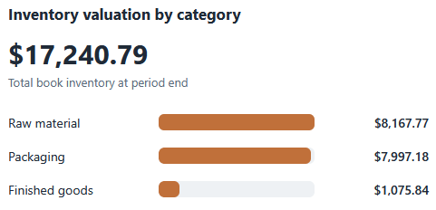
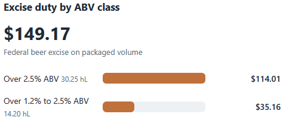
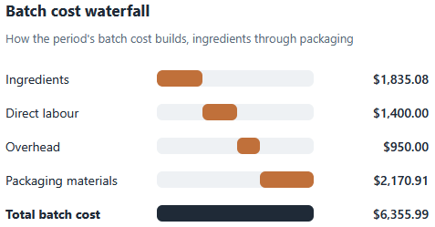
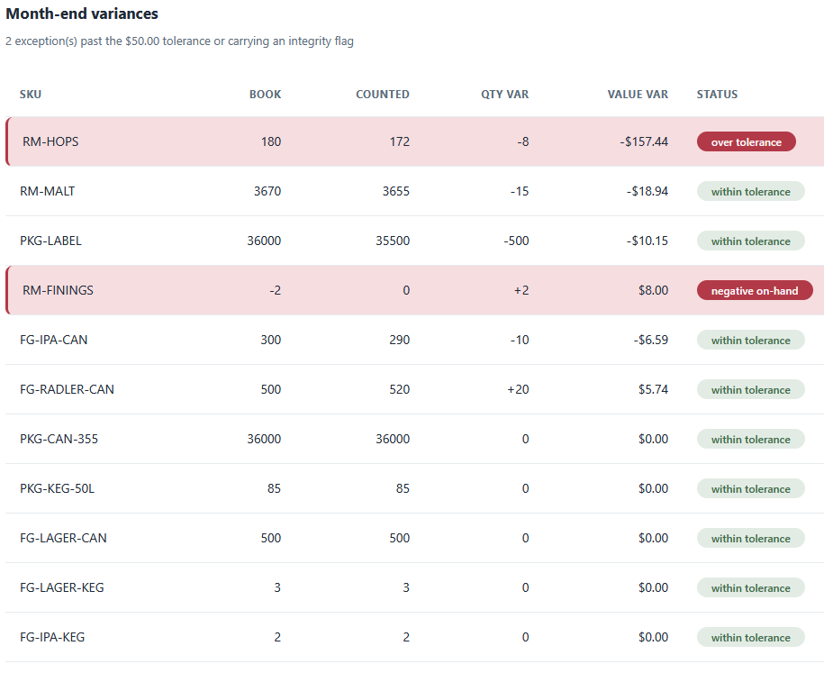
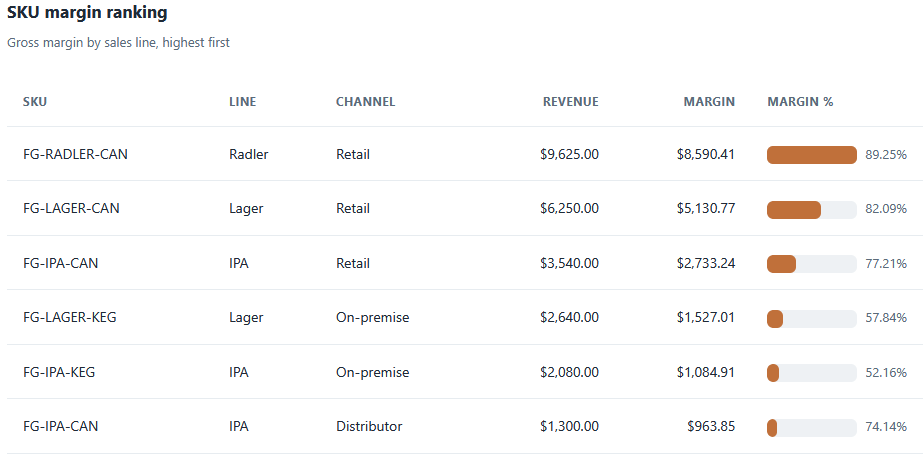

# Cost Dashboard

A browser dashboard that draws the period close on one page: inventory value by
category, a batch cost waterfall, excise duty by ABV class, the month-end count
variances, and the SKU margin ranking. It reads the CSVs the rest of the pipeline
produced and ties them together into one view.

## How it works
The dashboard is deterministic and rule-based, with the full rules in [spec.md](spec.md).
The arithmetic lives in a pure-logic file the test page imports; a thin script
wires it to the page. It is plain HTML, CSS, and vanilla JavaScript, so it opens
by double-clicking `index.html`, with no framework, no build step, and no server.
Files load with the browser's FileReader and stay on your machine. Money is
carried in integer cents and formatted only for display, so the figures match the
Python and SQL tools to the cent.

## Running it
Open the dashboard:

```
cd "C:\Users\jebo\Documents\Claude Code Projects\exekyute-daily-builds\job-modeled-toolkits\21-craft-brewery-cost-accounting-toolkit\07-cost-dashboard"
```

Double-click `index.html` (or open it in a browser). Click **Load sample data**
to draw the bundled close, or use **Load your own CSVs** and select the pipeline
files: `perpetual_valuation.csv`, `batch_costs.csv`, `sku_margins.csv`,
`excise_summary.csv`, and `physical_counts.csv`.

Open `tests.html` the same way to run the logic checks; it prints a green pass
count.

## In action




Total book inventory of $17,240.79, split across raw material, packaging, and finished goods.




Federal beer excise of $149.17, by ABV class and hectolitres.




How the period's batch cost builds, ingredients through packaging, to $6,355.99.




The count reconciliation, with the two exceptions banded: RM-HOPS over tolerance and RM-FININGS negative on-hand.




Gross margin by sales line, highest first.
