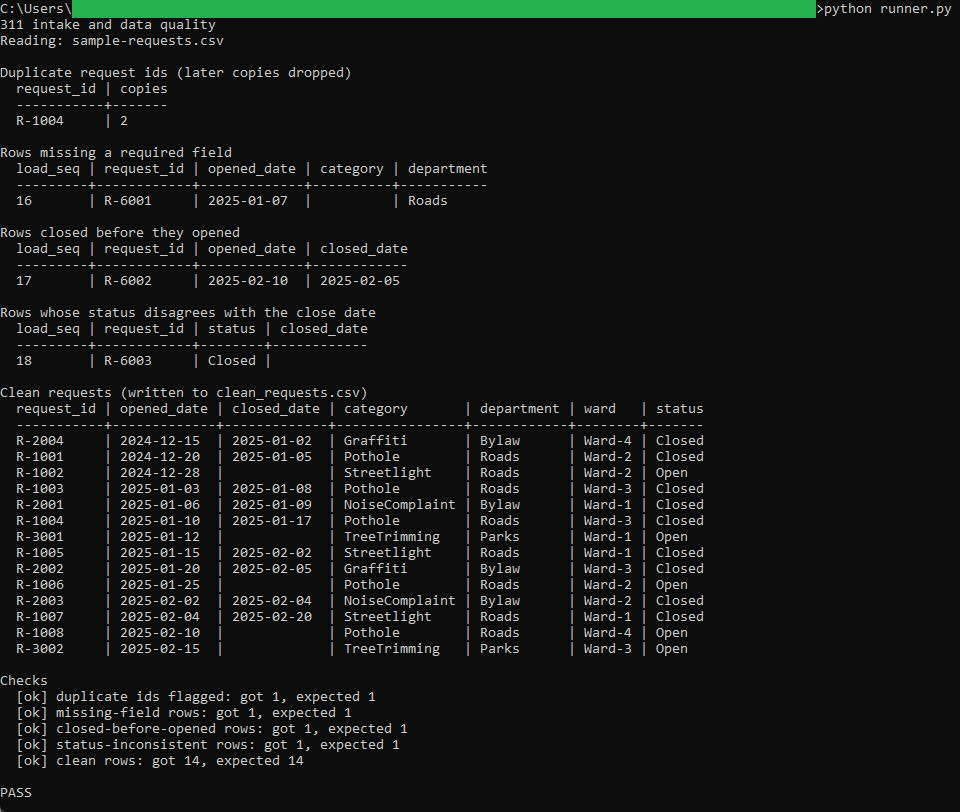
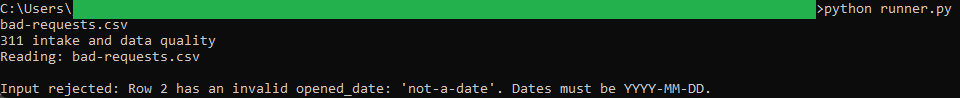

# Intake and data quality

Reads a raw export of 311 service requests, separates the clean rows from the rows
with problems, and writes the clean rows to a CSV the rest of the pipeline reads.

## How it works
Deterministic and rule-based, with the full rules in [spec.md](spec.md). The schema
lives in `schema.sql`, the five data-quality queries in `queries.sql`, each commented
with the question it answers. A thin Python runner builds an in-memory SQLite database
from the CSV, runs the queries, prints what each one found, checks the counts against
the expected numbers, and writes `clean_requests.csv`. It is command-line Python using
the standard library only (`csv`, `sqlite3`), so there is no install, no server, and
nothing leaves your machine.

The four checks: duplicate request ids (first copy kept), missing required fields,
a close date before the open date, and a status that disagrees with the close date.
Rows that pass all four become the clean set.

## Running it
From this folder:

```
python runner.py
```

That prints the flagged groups and the clean rows, writes `clean_requests.csv`, and
ends with `PASS` when the counts match `spec.md`.

To watch it reject a broken file:

```
python runner.py bad-requests.csv
```

The first row has an invalid date, so the run stops with the row number and the bad
value and writes nothing.

## In action



A full run on the sample data: the flagged groups, the fourteen clean rows written to
`clean_requests.csv`, and the checks block ending in PASS.



Running it against `bad-requests.csv` stops on the first invalid date, names the row
and the bad value, and writes nothing.
