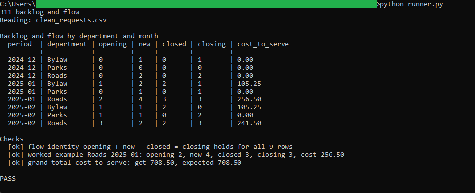

# Backlog and flow

Rolls the clean service requests forward month by month and shows, per department,
the opening backlog, requests opened, requests closed, the closing backlog, and the
cost to serve what was closed.

## How it works
Deterministic and rule-based, with the full rules in [spec.md](spec.md). The schema is
in `schema.sql`, the flow query in `queries.sql`. A thin Python runner builds an
in-memory SQLite database from `clean_requests.csv` and `category-cost-rates.csv`,
seeds the reporting months from the data, runs the query, prints the table, confirms
the flow identity (opening + new - closed = closing) holds for every row, checks the
worked example and the grand total, and writes `period-summary.csv`. Command-line
Python, standard library only (`csv`, `sqlite3`, `decimal`). Money is held in integer
cents so totals stay exact.

## Running it
From this folder:

```
python runner.py
```

That prints the backlog table, writes `period-summary.csv`, and ends with `PASS` when
the identity holds and the numbers match `spec.md`.

`clean_requests.csv` here is the output of the intake tool. To regenerate it, run that
tool and copy its `clean_requests.csv` into this folder, or point this runner at it:

```
python runner.py ../01-intake-and-data-quality/clean_requests.csv
```

## In action



The backlog table per department and month, the flow identity confirmed for all nine
rows, the worked example for Roads in 2025-01, and the $708.50 grand total, ending in
PASS.
