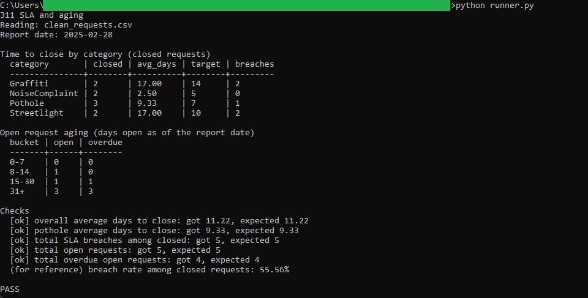

# SLA and aging

Measures time to close against category targets for the resolved requests, and the
age of the still-open backlog, and writes both for the dashboard.

## How it works
Deterministic and rule-based, with the full rules in [spec.md](spec.md). The schema is
in `schema.sql`, the two analytical queries in `queries.sql`. A thin Python runner
builds an in-memory SQLite database from `clean_requests.csv` and `sla-targets.csv`,
sets the report date to the last day of the latest open month, runs the queries,
prints the tables, checks the headline numbers, and writes `category-sla.csv` and
`sla-aging.csv`. Command-line Python, standard library only (`csv`, `sqlite3`,
`decimal`, `datetime`). Averages are rounded once, in the runner, so they match the
dashboard.

## Running it
From this folder:

```
python runner.py
```

That prints the time-to-close and aging tables, writes the two CSVs, and ends with
`PASS` when the numbers match `spec.md`.

`clean_requests.csv` here is the output of the intake tool. To point this runner at
the intake folder directly:

```
python runner.py ../01-intake-and-data-quality/clean_requests.csv
```

## In action



Time to close by category against target, the open backlog aged into buckets, and the
checks block (overall 11.22 days, five open, four overdue), ending in PASS.
