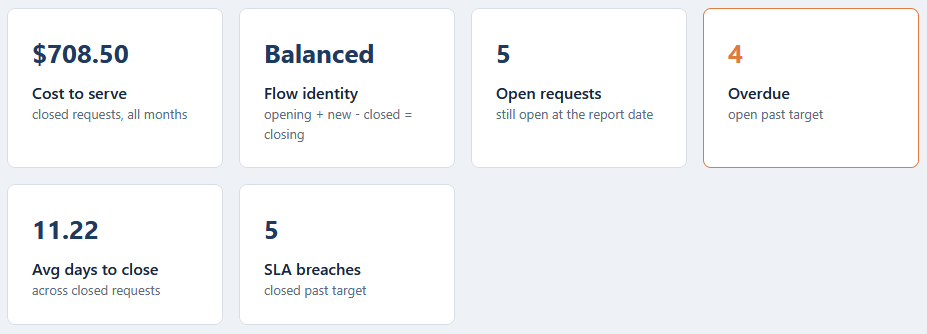
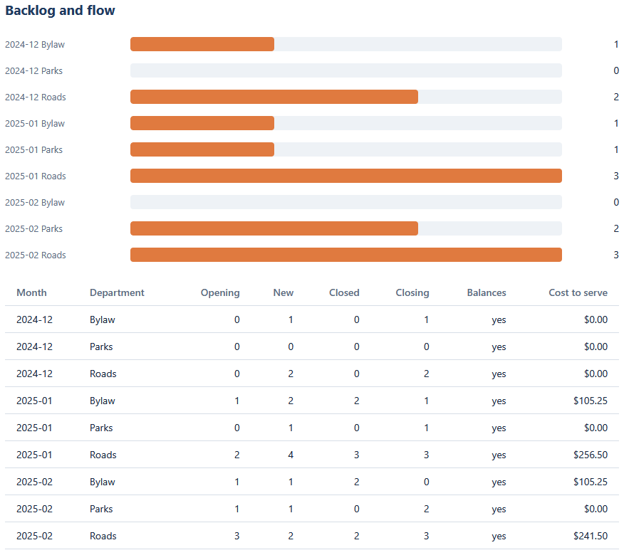
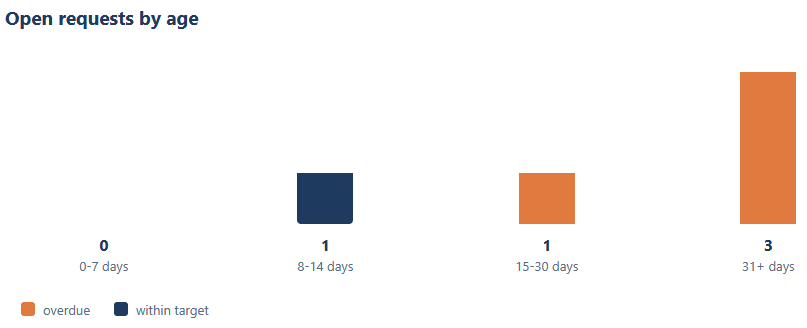
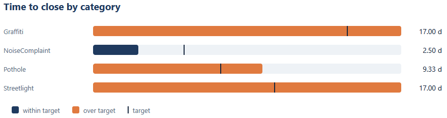

# Operations dashboard

Shows the backlog and flow, the open requests by age, and time to close against target,
all from the CSVs the SQL tools write, on one page.

## How it works
Deterministic and rule-based, with the full rules in [spec.md](spec.md). It is plain
HTML, CSS, and JavaScript: it opens by double-clicking `index.html`, with no server, no
build step, and no framework. Every file is read in the browser with the FileReader
API, so nothing is uploaded.

The logic is written in TypeScript in `src/` and compiled to plain JavaScript in
`dist/`, which is what the page loads. The pure logic in `src/dashboard.ts` has no
page access, so the test harness checks it directly. Cost to serve is summed in
integer cents and averages are rounded once, the same way the SQL runners round, so
the dashboard matches them to the cent.

## Running it
Open `index.html` in a browser, click "Choose CSV files", and pick the three sample
CSVs in this folder together:

- `sample-period-summary.csv`
- `sample-sla-aging.csv`
- `sample-category-sla.csv`

Open `tests.html` to run the checks; it prints how many passed.

To rebuild `dist/` from the TypeScript source (optional, the compiled files are already
included):

```
npx -p typescript tsc -p tsconfig.json
```

To see a broken file caught, load `bad-period-summary.csv`: its Roads 2025-01 row does
not balance, so the dashboard shades the row and the flow identity card reads 1 off.

## In action



The metrics strip after loading the three CSVs: cost to serve $708.50, the flow
identity balanced, five open requests with four overdue, an average of 11.22 days to
close, and five SLA breaches.



The backlog chart and flow table, with Roads in 2025-01 showing opening 2, new 4,
closed 3, closing 3, and a cost to serve of $256.50.



The open backlog by age bucket, with the overdue share in the accent color.



Average days to close by category against the target marker, with categories over
target drawn in the accent color.
