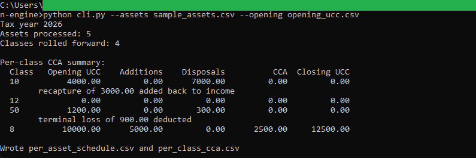
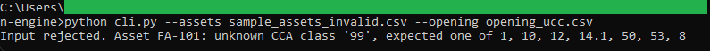

# CCA depreciation engine

A command-line tool that reads a fixed-asset register and the opening
undepreciated capital cost for each CRA class, then writes two schedules: book
depreciation per asset and the Capital Cost Allowance rollforward per class.

## How it works

The engine is deterministic and rule-based, with the full rules in
[spec.md](spec.md). It is command-line Python using the standard library only, so
there is nothing to install and it runs entirely on your machine. The logic, the
input validation, and the file handling live in separate files: `cca.py` holds the
depreciation math as pure functions, `validation.py` checks every row, and
`cli.py` reads the CSVs and writes the output.

Money is handled with `decimal.Decimal` and rounded half up to the cent, so the
figures tie exactly to the SQL rollforward in
[../02-asset-register-rollforward](../02-asset-register-rollforward) and the
browser dashboard in [../03-fixed-asset-dashboard](../03-fixed-asset-dashboard).

## Running it

From this folder.

Run the test suite:

```
python -m unittest
```

Run the engine against the sample register:

```
python cli.py --assets sample_assets.csv --opening opening_ucc.csv
```

This prints a per-class summary and writes `per_asset_schedule.csv` and
`per_class_cca.csv`. The default tax year is 2026; pass `--year` to change it.

See it reject bad input:

```
python cli.py --assets sample_assets_invalid.csv --opening opening_ucc.csv
```

## In action



The engine run against the sample register: the per-class summary with class 8 taking
2,500.00 of CCA to a closing UCC of 12,500.00, the class 10 recapture of 3,000.00, and
the class 50 terminal loss of 900.00.



An invalid register is stopped at the door with a message naming the asset and the
problem, here an unknown CCA class.
