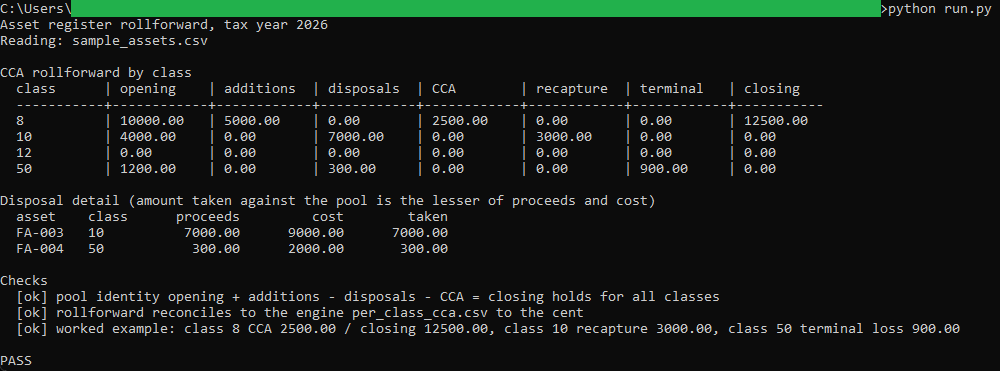
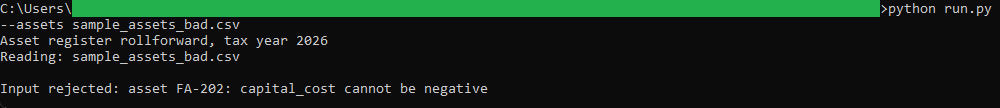

# Asset register rollforward

A SQLite tool that rebuilds the CCA pool for each class from the asset register
and the opening balances, then reconciles it to the depreciation engine to the
cent.

## How it works

The tool is deterministic and rule-based, with the full rules in [spec.md](spec.md).
It is a single `.sql` file plus a thin Python runner, both standard library only,
with no database server and nothing to install. `schema.sql` holds the table
definitions and the dated CRA class rate table, `queries.sql` holds the rollforward
queries, and `run.py` builds an in-memory database, runs the queries, applies the
class rate math, and checks the result.

Money is stored as integer cents so the aggregation stays exact. The runner rounds
CCA half up to the cent, the same rule the engine uses, so the SQL rollforward and
the engine in [../01-cca-depreciation-engine](../01-cca-depreciation-engine) agree
on every figure. The runner is also the test: it prints PASS only when the pool
identity holds for every class, the rollforward reconciles to the engine output,
and the worked example matches.

## Running it

From this folder.

Run the rollforward and the reconciliation:

```
python run.py
```

This prints the rollforward table, the disposal detail, the checks, and a PASS or
FAIL line. The engine output `per_class_cca.csv` is included here; regenerate it by
running the engine in the `01` folder if you change the register.

See it reject bad input:

```
python run.py --assets sample_assets_bad.csv
```

## In action



The runner prints the rollforward by class, the disposal detail, and the checks. The
pool identity holds for every class, the rollforward reconciles to the engine output to
the cent, and the worked example matches, so the run ends on PASS.



A register with a negative cost is rejected before any rollforward is built.
