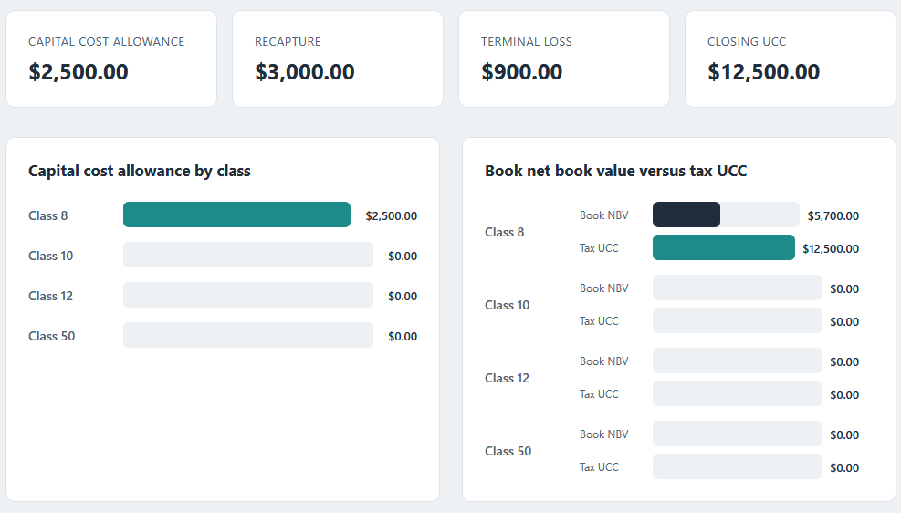
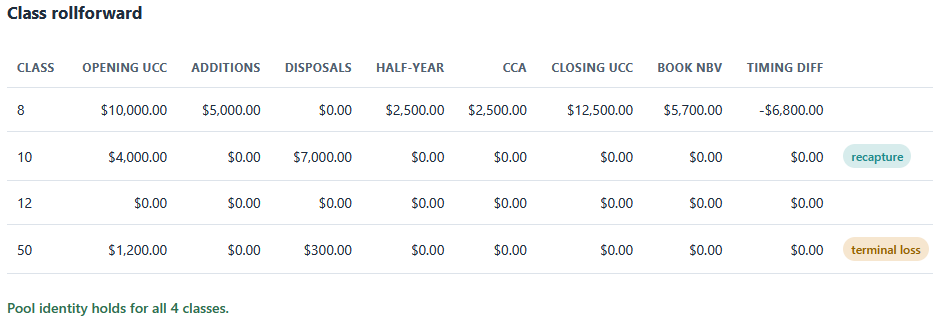

# Fixed-asset dashboard

A browser dashboard that reads the per-class CCA file from the depreciation engine
and shows Capital Cost Allowance by class, book-versus-tax timing, and the asset
register rollforward.

## How it works

The dashboard is deterministic and rule-based, with the full rules in
[spec.md](spec.md). It is plain HTML, CSS, and vanilla JavaScript: it opens by
double-clicking `index.html`, with no framework, no build step, and no server. The
calculation lives in `src/dashboard.js` as pure functions, `src/ui.js` paints the
result onto the page, and the markup is in `index.html`. Money is carried in
integer cents and formatted with `Intl.NumberFormat`, so the figures match the
engine in [../01-cca-depreciation-engine](../01-cca-depreciation-engine) and the SQL
rollforward in [../02-asset-register-rollforward](../02-asset-register-rollforward)
to the cent.

Files are read with the FileReader API and stay on your machine; nothing is
uploaded.

## Running it

Open `index.html` in a browser by double-clicking it. The sample data loads on
open. Use "Load a per_class_cca.csv" to view your own engine output, or "Load
sample data" to return to the sample. A bad file, such as
`sample_per_class_cca_bad.csv`, is reported in red.

Run the tests by opening `tests.html` in a browser. It checks the pure logic and
prints how many checks passed.

## In action

The dashboard on the sample data: the summary cards, the Capital Cost Allowance by
class, and the book net book value against the tax UCC, where class 8 carries 5,700.00
on the books against a 12,500.00 tax UCC.

The class rollforward, with the recapture and terminal-loss tags on the class 10 and
class 50 disposals, and the pool identity confirmed for every class.
