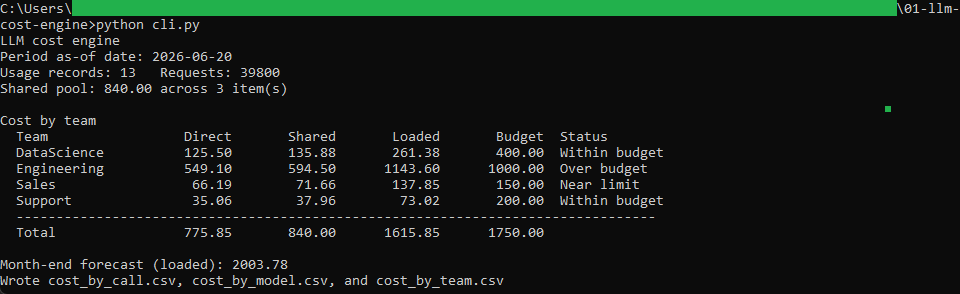
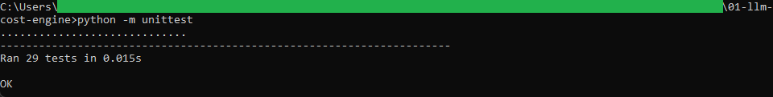

# LLM cost engine

A command-line tool that prices a month of LLM usage, allocates the cost across
teams, checks each team against its budget, and forecasts where spend lands by month
end. It is the first tool in the AI operations toolkit and the one the other two read.

## How it works

It is deterministic and rule-based, with the full rules written out in [spec.md](spec.md).
Each usage record is priced from an editable rate card: cached input tokens at the
cached rate, the rest of the input at the full rate, and output at the output rate.
Costs roll up by team and by model. A shared monthly pool (a platform fee and the
like) is split across teams in proportion to their direct cost using the largest-remainder
method, so the parts sum to the pool exactly. Each team's loaded cost is then compared
to its budget, and a straight run rate projects the month-end figure.

It is command-line Python using the standard library only (`csv`, `decimal`,
`calendar`). Money is handled with `decimal.Decimal` rounded half up to the cent, so
the figures match the SQL reconciliation and the browser dashboard exactly.

## Running it

From this folder:

```
cd "C:\Users\jebo\Documents\Claude Code Projects\exekyute-daily-builds\job-modeled-toolkits\24-ai-operations-toolkit\01-llm-cost-engine"
```

Run the test suite:

```
python -m unittest
```

Run the engine against the sample files:

```
python cli.py
```

It writes `cost_by_call.csv`, `cost_by_model.csv`, and `cost_by_team.csv` next to the
script and prints the per-team summary. You can point it at your own files and set the
forecast as-of date:

```
python cli.py --usage usage_log.csv --prices price_book.csv --shared shared_costs.csv --budgets budgets.csv --asof 2026-06-20
```

To see the validation reject a bad file (a record whose cached tokens exceed its input):

```
python cli.py --usage usage_log_invalid.csv
```

## In action
Pricing the sample month: per-team direct, shared, and loaded cost against budget, with the run-rate forecast.



The test suite covering the pricing, the largest-remainder allocation, the budget rules, and the input validation.


