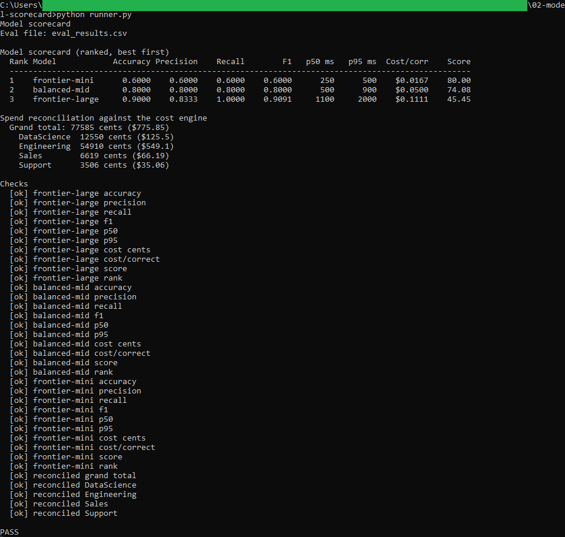

# Model scorecard

A SQL tool that scores and ranks the models a team could use for one task, from a set
of evaluation results, and reconciles the team's LLM spend against the cost engine.

## How it works

It is deterministic and rule-based, with the full rules in [spec.md](spec.md). The
analytical work is a set of SQL queries in `queries.sql`, run against an in-memory
SQLite database that the Python runner builds from the eval results and the cost
engine's per-call output. The queries produce the confusion-matrix counts and the
nearest-rank latency percentiles per model. The runner turns those counts into
accuracy, precision, recall, F1, cost per correct, and a single weighted score, then
ranks the models. It also re-aggregates the cost engine's per-call costs and confirms
the grand total and every team total match to the cent.

It runs on SQLite through the standard-library `sqlite3` module, so there is no
database server and nothing to install. Cost is carried in whole cents and the derived
metrics use `decimal.Decimal`, so the figures are exact.

## Running it

From this folder:

```
cd "C:\Users\jebo\Documents\Claude Code Projects\exekyute-daily-builds\job-modeled-toolkits\24-ai-operations-toolkit\02-model-scorecard"
```

Run the scorecard against the sample data. The runner prints the ranked scorecard and
the reconciliation, checks every figure against the numbers in spec.md, and writes
`model_scorecard.csv`:

```
python runner.py
```

The `cost_by_call.csv` in this folder is a copy of the cost engine's output, so the
reconciliation can run on its own. To rebuild it, run tool 01 and copy its
`cost_by_call.csv` here.

To see the runner reject a bad file (a row whose predicted label is not approve or reject):

```
python runner.py eval_results_bad.csv
```

## In action
The runner scoring and ranking the three models, then reconciling every team total against the cost engine to the cent and printing a clean pass.


