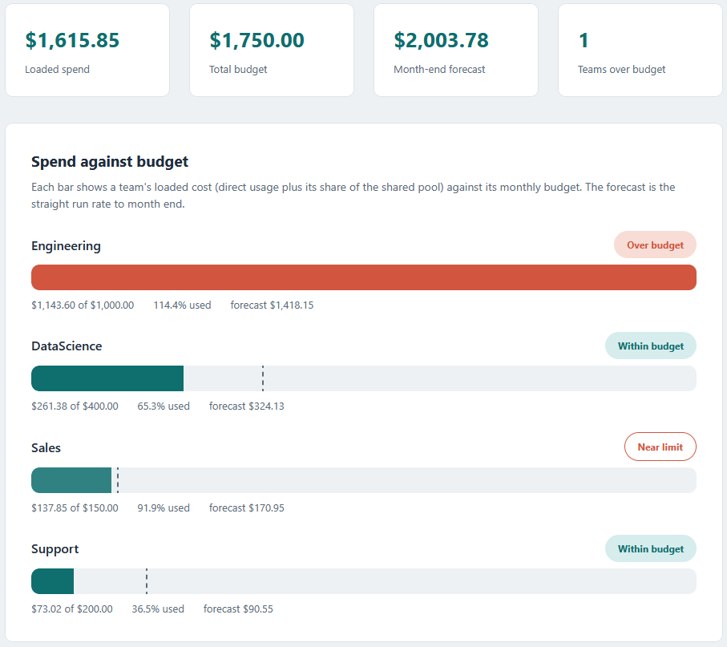
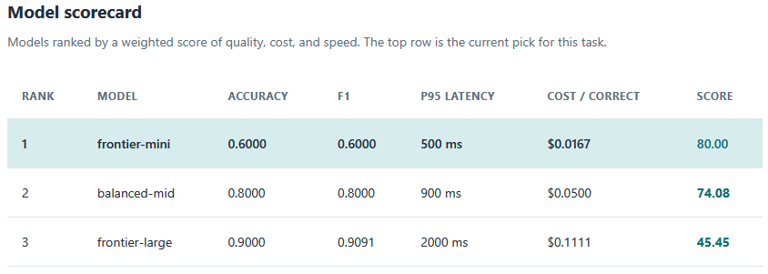

# AI operations dashboard

A single page that shows an AI program's spend against budget by team, the month-end
forecast, and the ranked model scorecard. It reads the output of the cost engine and
the scorecard tool and lays it out for a quick read.

## How it works

It is a browser tool that opens by double-clicking its HTML file. There is no server,
no build step, and no framework. The page reads two CSV files: the cost engine's
`cost_by_team.csv` and the scorecard tool's `model_scorecard.csv`. Files are read in
the browser with the FileReader API and stay on your machine.

The calculation logic is kept in `src/dashboard.js` as pure functions with no page
access, so it can be tested on its own. It holds money in whole cents and re-derives
each team's budget status with the same rule the cost engine uses, so the dashboard
reaches its own verdict and the figures match the other tools to the cent. The full
rules are in [spec.md](spec.md).

## Running it

From this folder:

```
cd "C:\Users\jebo\Documents\Claude Code Projects\exekyute-daily-builds\job-modeled-toolkits\24-ai-operations-toolkit\03-ai-ops-dashboard"
```

Open `index.html` by double-clicking it, or serve the folder and open it in a browser.
The sample data loads on open. Use the file pickers to load your own
`cost_by_team.csv` and `model_scorecard.csv`, which the cost engine and the scorecard
tool write. To see the validation reject a bad file, load `cost_by_team_bad.csv`,
which is missing the loaded-cost column.

Run the tests by opening `tests.html`. It checks the parsing, the cent math, the
budget rules, and the scorecard sort, and prints a green pass count.

## In action
Loaded spend against budget, the month-end forecast, and the teams flagged over or near their limit.



The model scorecard, ranked by the weighted score with the current pick on top.


