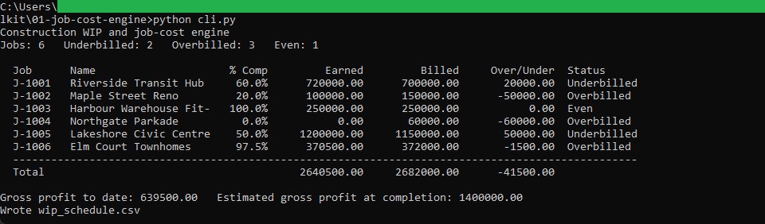
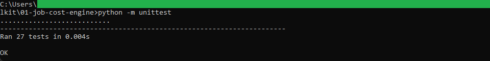
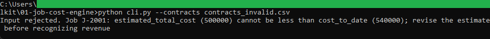

# Job-cost engine

A command-line tool that turns a list of construction contracts into a
work-in-progress schedule: percent complete, earned revenue, gross profit, and
the over or under billing position for every job.

## How it works

It reads `contracts.csv`, validates every row, and recognizes revenue by
cost-to-cost percent complete (cost to date divided by the current estimated total
cost, times the contract value). It writes `wip_schedule.csv`, which the workbook
builder in the next tool reads. The logic, the validation, and the command-line
wrapper are kept in separate files, and all money is computed with
`decimal.Decimal` rounded half up to the cent. It is command-line Python with the
standard library only, and the full rules are in [spec.md](spec.md).

## Running it

From this folder:

```
python -m unittest          # run the test suite
python cli.py               # build the schedule from contracts.csv
```

`python cli.py` prints the schedule and writes `wip_schedule.csv` next to the
script. To see the validation reject a bad file:

```
python cli.py --contracts contracts_invalid.csv
```

That file has a job whose cost to date is above its estimated total cost, so the
run stops with a message naming the job and exits without writing output.

## In action



The engine printing the WIP schedule from the sample contracts. J-1001 is 60
percent complete, has earned 720,000.00 against 700,000.00 billed, and shows as
underbilled by 20,000.00.



The 27 unit tests passing, covering the percent-complete and earned-revenue math,
the billing position, and every validation rule.



A run against the invalid sample stopping with a clear message. A job whose cost to
date is above its estimated total cost is rejected before any revenue is
recognized.
