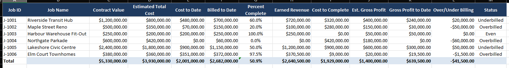
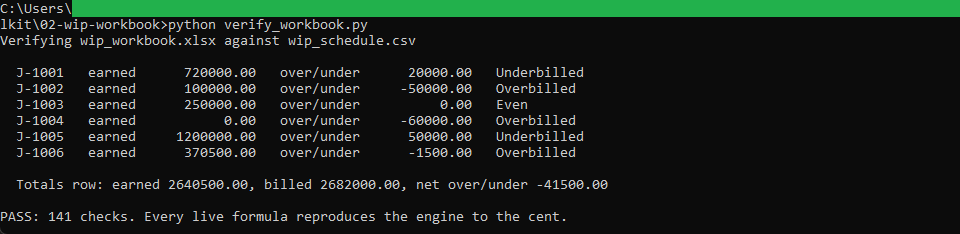

# WIP workbook builder and verifier

Two command-line tools. The builder turns the engine's schedule CSV into a
formatted Excel workbook with live formulas. The verifier proves the workbook's
formulas reproduce the engine's numbers to the cent.

## How it works

`build_workbook.py` reads `wip_schedule.csv` (written by the engine in
[../01-job-cost-engine](../01-job-cost-engine)) and writes `wip_workbook.xlsx`.
The four job inputs go in as values; percent complete, earned revenue, gross
profit, the over/under position, and the status are live Excel formulas, so
opening the workbook and changing an input recomputes the row. A Dashboard sheet
totals the schedule and counts jobs by billing position.

`verify_workbook.py` is the test. Because openpyxl writes formulas but does not
compute them, the verifier carries a small formula evaluator (`formula_eval.py`)
that computes each cell straight from the workbook's own inputs, then checks the
result against the engine's schedule to the cent. The evaluator never opens Excel
and never calls the engine, so it is an independent check.

This tool uses `openpyxl` (see [requirements.txt](requirements.txt)). The column
layout and every formula live in `formulas.py`, shared by the builder and the
verifier. Full rules are in [spec.md](spec.md).

## Running it

From this folder, install the one dependency, build, then verify:

```
python -m pip install -r requirements.txt
python build_workbook.py        # writes wip_workbook.xlsx
python verify_workbook.py        # checks every formula to the cent, prints PASS
```

`wip_schedule.csv` is the engine's output, kept here so this tool runs on its own.
To rebuild it from scratch, run the engine in `01` and copy its `wip_schedule.csv`
into this folder first.

Open `wip_workbook.xlsx` in Excel or LibreOffice to see the live formulas. Change
a cost-to-date cell in column E and the row's percent complete, earned revenue,
and billing position update.

## In action



The generated workbook open in Excel. The four job inputs sit in columns C to F and
the derived columns are live formulas, with the over/under column shaded green for
underbilled jobs and red for overbilled ones.



The verifier confirming all 141 checks, so every live formula in the workbook
reproduces the engine to the cent.


The earned-revenue cell selected, with the formula bar showing
=ROUND(C2*E2/D2,2). The numbers are computed in the workbook, not pasted in.
