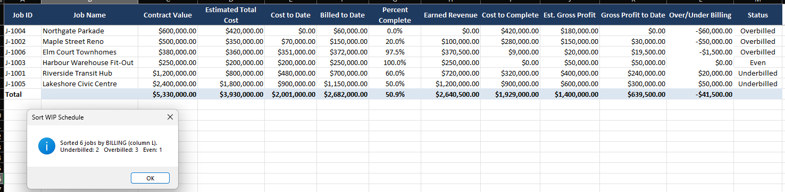
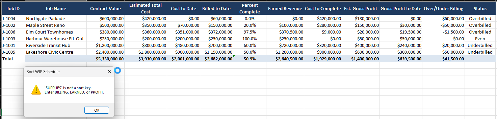

# WIP refresh macro

An Excel VBA macro that sorts the WIP Schedule sheet in place by a column you
choose, then reports how many jobs are underbilled, overbilled, and even.

## How it works

The macro reads the `WIP Schedule` sheet from the workbook the builder in
[../02-wip-workbook](../02-wip-workbook) produces. It asks which column to sort by
(BILLING, EARNED, or PROFIT), sorts the job rows by that column, and shows a count
of jobs in each billing position. It sorts and counts only; the schedule's own
formulas recompute as Excel moves the rows. The valid sort keys and the row-finding
logic are kept in their own functions, separate from the sub that touches cells.
Full rules and the manual test are in [spec.md](spec.md).

## Running it

This is an Excel macro, so it is imported and run inside Excel rather than from the
command line.

1. Build the workbook: from `../02-wip-workbook`, run `python build_workbook.py`,
   then open `wip_workbook.xlsx` in Excel.
2. Press Alt+F11 to open the VBA editor, choose File then Import File, and import
   `WipRefresh.bas`.
3. With the WIP Schedule sheet active, press Alt+F8, select `SortWipSchedule`, and
   run it. Enter BILLING when prompted.

To see the input check, run it again and enter a word that is not a sort key, such
as SUPPLIES. The macro shows a message naming the valid keys and leaves the
schedule unchanged.

## In action

The macro after sorting by billing position. The most overbilled jobs move to the
top and the message box reports Underbilled: 2, Overbilled: 3, Even: 1.

Entering a word that is not a sort key. The macro names the valid keys and leaves
the schedule unchanged.
