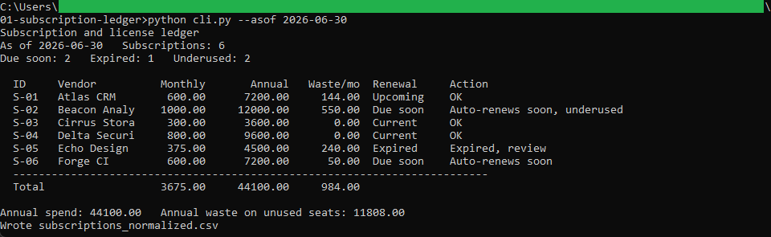
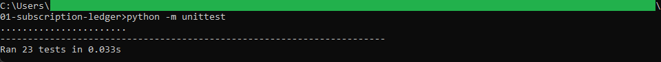
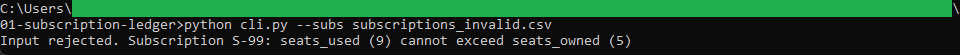

# Subscription ledger

A command-line tool that costs a SaaS subscription portfolio: monthly and annual
spend, unused-seat waste, days to renewal, and a plain next step for each plan.

## How it works

It reads `subscriptions.csv`, validates every row, and works out the cost, the seat
waste, and the renewal position for each subscription. It writes
`subscriptions_normalized.csv`, which the license manager app in
[../02-license-manager](../02-license-manager) reads. Logic, validation, and the
command-line wrapper are in separate files, and money is computed with
`decimal.Decimal` rounded half up to the cent. It is command-line Python with the
standard library only, and the full rules are in [spec.md](spec.md).

## Running it

From this folder:

```
python -m unittest
python cli.py --asof 2026-06-30
```

`python cli.py` prints the ledger and writes `subscriptions_normalized.csv`. The
`--asof` date sets the renewal clock; it defaults to today. To see a bad file
rejected:

```
python cli.py --subs subscriptions_invalid.csv
```

## In action



The ledger printed from the sample subscriptions. The portfolio runs 3,675.00 a
month and 44,100.00 a year, with 11,808.00 of that spent on unused seats, and S-02
is flagged as auto-renewing soon while underused.



The 23 unit tests passing, covering the cost and waste math, the renewal labels, the
suggested action, and every validation rule.



A run against the invalid sample stopping with a clear message. A subscription that
uses more seats than it owns is rejected before any cost is worked out.
