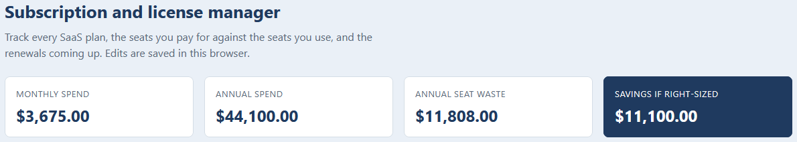
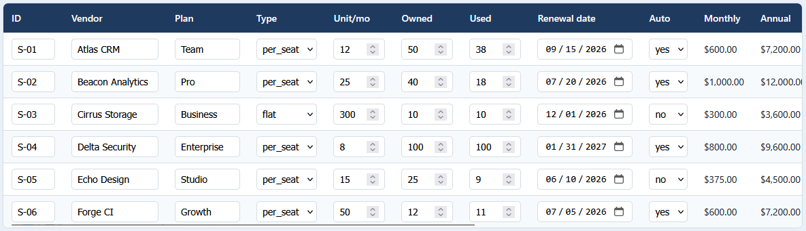
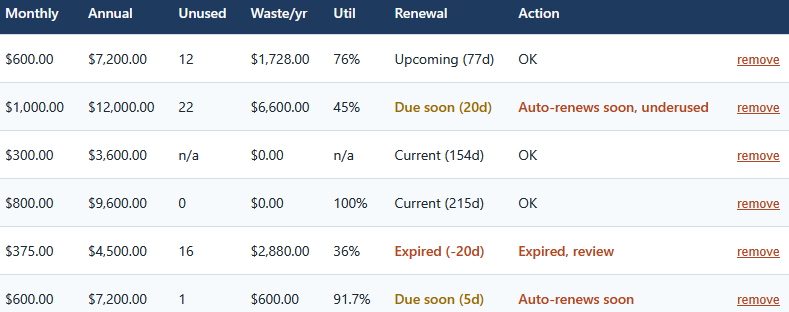

# License manager app

A browser tool for working a SaaS subscription portfolio: an editable table that
recomputes cost, seat waste, and renewals as you change it, with the list saved in
your browser and a printable report.

## How it works

The app opens with the sample portfolio and can import a CSV in the engine's input
format. Each plan is edited in place, and the monthly and annual cost, the unused
seats and their waste, the utilization, and the renewal status update as you type.
The summary across the top tracks total spend, annual seat waste, the due-soon,
expired, and underused counts, and the annual savings if the portfolio were
right-sized. Edits are kept in the browser's localStorage, so they survive a
refresh.

The arithmetic lives in `src/subscriptions.js` and mirrors the Python ledger in
[../01-subscription-ledger](../01-subscription-ledger) to the cent. It is plain
HTML, CSS, and vanilla JavaScript, opens by double-clicking `index.html`, keeps
every file on your machine, and uses no framework, no build step, and no server.
Full rules are in [spec.md](spec.md).

## Running it

Double-click `index.html` to open the app. Double-click `tests.html` to run the
test page, which checks the logic against the same numbers as the engine and prints
PASS or FAIL with a green count.

To load your own data, click Import CSV and choose a file in the format of
`subscriptions.csv`. Reset to sample restores the built-in portfolio. Print report
opens a clean report you can print or save to PDF.

## In action

The portfolio summary across the top: 3,675.00 a month, 44,100.00 a year, 11,808.00 of
annual seat waste, and 11,100.00 a year that right-sizing the underused and expired
plans would save.

Every subscription in an editable row. Changing a plan's seats, cost, or renewal date
recomputes the line in place, and the edits are saved in the browser.

The computed side of the table: monthly and annual cost, unused seats and their yearly
waste, utilization, the renewal status, and a plain action such as "Auto-renews soon,
underused".

The counts that need attention at a glance: renewals due soon, expired plans, and
underused plans.
