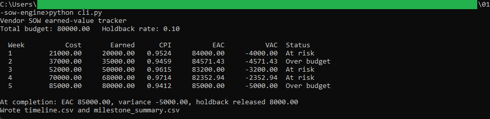
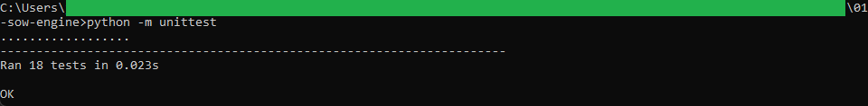
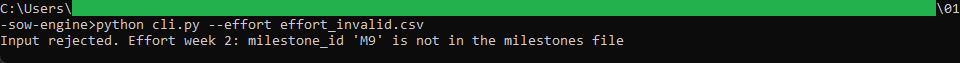

# SOW engine

A command-line tool that tracks a vendor statement of work by earned value: cost
to date and earned value week by week, the cost performance index, the estimate at
completion, the variance, and the holdback.

## How it works

It reads `milestones.csv` and `effort_log.csv`, validates both, and walks the SOW
week by week. At each week it works out how much budget has been earned, how much
has been spent, and what the whole job looks set to cost at the current pace. It
writes `timeline.csv`, which the browser view in
[../02-sow-timeline](../02-sow-timeline) reads, and `milestone_summary.csv`. Logic,
validation, and the command-line wrapper are in separate files, and money is
computed with `decimal.Decimal` rounded half up to the cent. It is command-line
Python with the standard library only, and the full rules are in [spec.md](spec.md).

## Running it

From this folder:

```
python -m unittest
python cli.py --holdback 0.10
```

`python cli.py` prints the timeline and writes `timeline.csv` and
`milestone_summary.csv`. To see a bad file rejected:

```
python cli.py --effort effort_invalid.csv
```

That file logs effort against a milestone that is not in the milestones file, so the
run stops with a message naming the entry.

## In action



The engine printing the week-by-week earned-value timeline from the sample SOW. By the
final week it has spent 85,000.00 against an 80,000.00 budget, so the estimate at
completion is 85,000.00, a 5,000.00 overrun, and the 8,000.00 holdback is released.



The 18 unit tests passing, covering the per-entry cost, earned value, CPI, the estimate
at completion, the holdback, and every validation rule.



A run against the invalid sample stopping with a clear message. Effort logged against a
milestone that is not in the milestones file is rejected before any value is computed.
