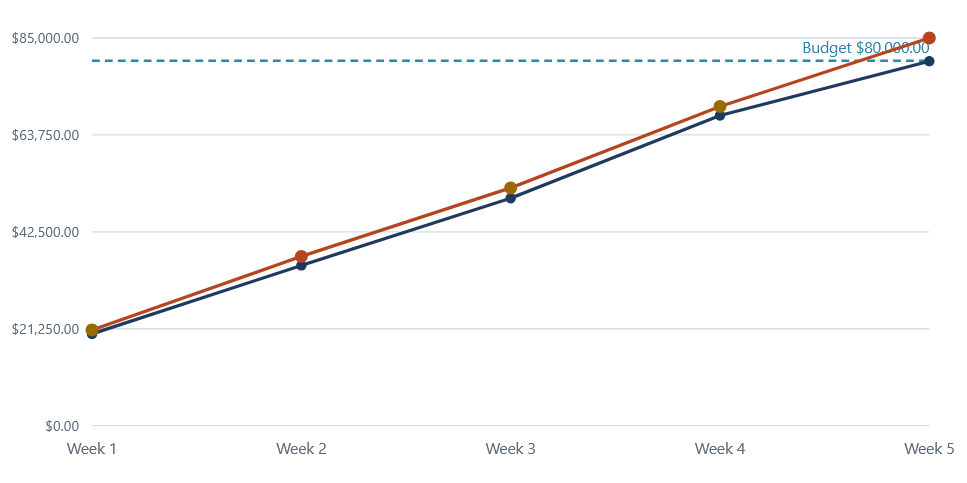
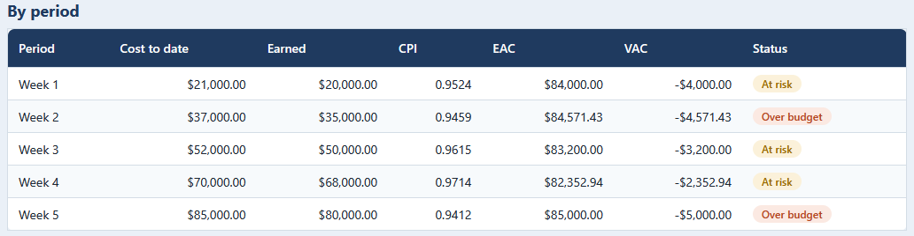
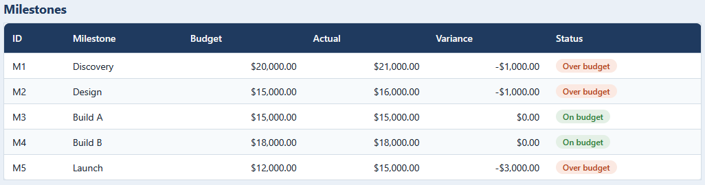

# SOW timeline view

A browser view of the vendor SOW earned-value timeline: a burn chart of cost to date
and earned value against the budget, with per-week and per-milestone tables.

## How it works

The view opens with the sample timeline built in and can import a fresh
`timeline.csv` from the engine. It draws an SVG chart with a cost line, an earned-value
line, and a dashed budget rule, coloring each week by its status, and lists every
period and milestone below. The summary cards track the estimate at completion, the
variance, and the holdback released.

The parsing, chart geometry, and formatting live in `src/timeline.js` and mirror the
engine in [../01-sow-engine](../01-sow-engine) to the cent. It is plain HTML, CSS, and
vanilla JavaScript, opens by double-clicking `index.html`, keeps every file on your
machine, and uses no framework, no build step, and no server. Full rules are in
[spec.md](spec.md).

## Running it

Double-click `index.html` to open the view. Double-click `tests.html` to run the test
page, which checks the logic against the engine's numbers and prints PASS or FAIL with
a green count.

Import timeline.csv loads a fresh run from the engine; Reset to sample restores the
built-in timeline.

## In action

The summary across the top: an 80,000.00 budget, an 85,000.00 estimate at completion, a
-5,000.00 variance, the 8,000.00 holdback released, and an over-budget status.

Cost to date and earned value week by week against the dashed budget rule. Both lines
climb to the budget by the final week, which is the overrun the estimate at completion
picks up.

Every week with its cost, earned value, CPI, estimate at completion, variance, and
status, moving between at-risk and over-budget as the run rate climbs.

Each milestone with its budget, actual cost, and variance. Discovery, Design, and Launch
come in over budget; Build A and Build B land on budget.
