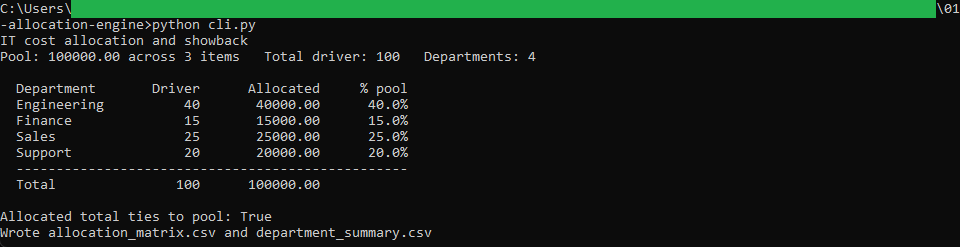
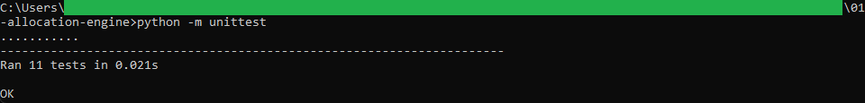
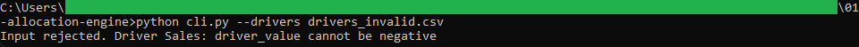

# Allocation engine

A command-line tool that splits a pool of shared IT costs across departments by a
driver such as headcount, so each department sees its share of every cost item.

## How it works

It reads `cost_pool.csv` and `drivers.csv`, validates both, and splits every cost item
across the departments in proportion to their driver value, using the largest-remainder
method so the parts sum to each item exactly and the department totals sum to the whole
pool. It writes `allocation_matrix.csv`, which the workbook builder in
[../02-chargeback-workbook](../02-chargeback-workbook) reads, and
`department_summary.csv`. Logic, validation, and the command-line wrapper are in
separate files, and money is computed with `decimal.Decimal` rounded half up to the
cent. It is command-line Python with the standard library only, and the full rules are
in [spec.md](spec.md).

## Running it

From this folder:

```
python -m unittest
python cli.py
```

`python cli.py` prints the allocation and writes the two CSV files. To see a bad file
rejected:

```
python cli.py --drivers drivers_invalid.csv
```

That file has a negative driver value, so the run stops with a message naming the
department.

## In action



The engine printing the allocation from the sample pool. The 100,000.00 pool splits
across the four departments by headcount, Engineering taking 40,000.00, and the
allocated total ties back to the pool.



The 11 unit tests passing, covering the largest-remainder split, the tie-out to the
pool, and every validation rule.



A run against the invalid sample stopping with a clear message. A negative driver
value is rejected before any cost is split.
