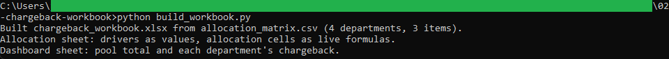
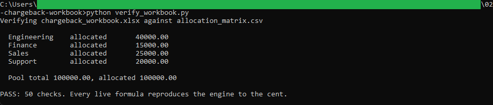

# Chargeback workbook builder and verifier

Two command-line tools. The builder turns the engine's allocation matrix into a
formatted Excel workbook with live formulas. The verifier proves the workbook's formulas
reproduce the engine's allocation to the cent.

## How it works

`build_workbook.py` reads `allocation_matrix.csv` (written by the engine in
[../01-allocation-engine](../01-allocation-engine)) and writes
`chargeback_workbook.xlsx`. The department drivers go in as values and each allocation
cell is a live Excel formula, so changing a driver recomputes the split. A Dashboard
sheet totals the pool and lists each department's chargeback.

`verify_workbook.py` is the test. Because openpyxl writes formulas but does not compute
them, the verifier carries a small formula evaluator (`formula_eval.py`) that computes
each cell straight from the workbook's own pool and driver cells, then checks the result
against the engine's matrix to the cent. The evaluator never opens Excel and never calls
the engine.

This tool uses `openpyxl` (see [requirements.txt](requirements.txt)). The layout and
formulas live in `formulas.py`, shared by the builder and the verifier. Full rules are
in [spec.md](spec.md).

## Running it

From this folder, install the one dependency, build, then verify:

```
python -m pip install -r requirements.txt
python build_workbook.py
python verify_workbook.py
```

`allocation_matrix.csv` is the engine's output, kept here so this tool runs on its own.
Open `chargeback_workbook.xlsx` in Excel or LibreOffice to see the live formulas; change
a driver in column B and the department's allocation updates.

## In action



The builder turning the engine's allocation matrix into chargeback_workbook.xlsx, with
the department drivers written as values and the allocation cells as live formulas,
plus a dashboard sheet.



The verifier confirming all 50 checks, so every live formula in the workbook reproduces
the engine to the cent, with each department's chargeback and the pool tying out.
