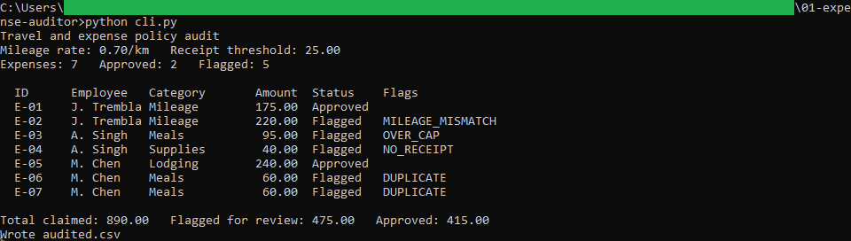
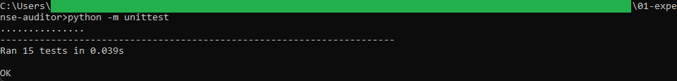
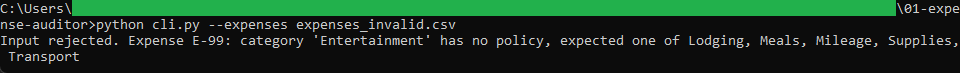

# Expense auditor

A command-line tool that checks travel and expense lines against a policy and flags
the ones that need review: mileage that does not match the rate, amounts over a
category cap, missing receipts, and duplicates.

## How it works

It reads `policy.csv` and `expenses.csv`, validates both, and applies the policy to
each line. It writes `audited.csv`, which the review app in
[../02-expense-review](../02-expense-review) reads. Logic, validation, and the
command-line wrapper are in separate files, and money is computed with
`decimal.Decimal` rounded half up to the cent. It is command-line Python with the
standard library only, and the full rules are in [spec.md](spec.md).

The mileage rate lives in `policy.csv` and is meant to be set to the current
prescribed allowance and updated each year.

## Running it

From this folder:

```
python -m unittest
python cli.py
```

`python cli.py` prints the audit and writes `audited.csv`. To see a bad file rejected:

```
python cli.py --expenses expenses_invalid.csv
```

That file has a category with no policy, so the run stops with a message naming the
expense.

## In action



The engine printing the audit from the sample batch. A 250 km mileage claim at 0.70
per km comes to 175.00 and is approved, while E-02 is flagged for a mileage mismatch
and E-03, E-04, E-06, and E-07 for over-cap, missing-receipt, and duplicate. The batch
claims 890.00 with 475.00 flagged for review.



The 15 unit tests passing, covering the mileage recompute, each policy flag, duplicate
detection, and every validation rule.



A run against the invalid sample stopping with a clear message. An expense in a
category with no policy is rejected before the batch is audited.
