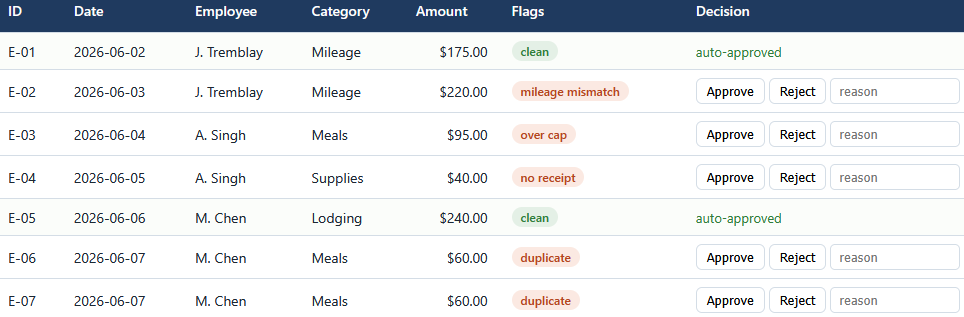
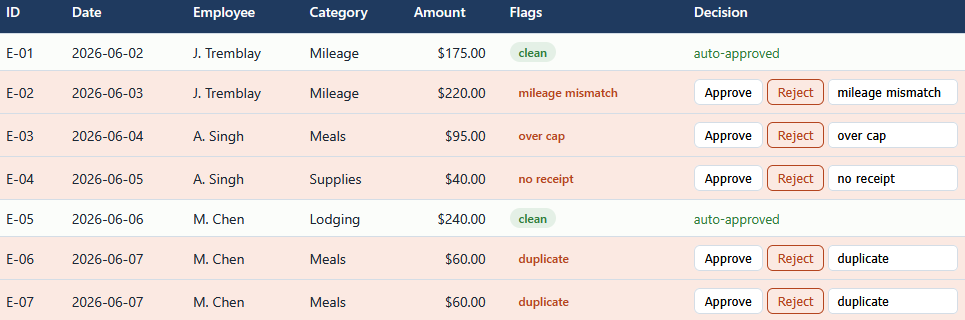

# Expense review app

A browser tool for working a travel and expense batch: every line is checked against
policy, flagged lines wait for an approve or reject with a reason, and the review is
saved in the browser.

## How it works

The app opens with the sample batch and can import an `expenses.csv` from the engine.
It flags each line the same way the auditor does (mileage mismatch, over cap, missing
receipt, duplicate), auto-approves the clean ones, and lets you approve or reject the
flagged ones. The summary tracks total claimed, the flagged amount, the approved and
rejected amounts, and how many lines are pending. A "flagged only" toggle hides the
clean lines, and Print report produces a clean report you can save to PDF.

The flagging lives in `src/audit.js` and mirrors the engine in
[../01-expense-auditor](../01-expense-auditor) to the cent. It is plain HTML, CSS, and
vanilla JavaScript, opens by double-clicking `index.html`, keeps every file on your
machine, and uses no framework, no build step, and no server. Full rules are in
[spec.md](spec.md).

## Running it

Double-click `index.html` to open the review queue. Double-click `tests.html` to run
the test page, which checks the flagging against the engine's numbers and prints PASS
or FAIL with a green count.

Import CSV loads a batch in the format of `expenses.csv`; Reset to sample restores the
built-in batch.

## In action

The review queue from the sample batch. Clean lines are approved on their own, and
each flagged line shows its reason: a mileage mismatch, an over-cap meal, a missing
receipt, and a duplicate pair.

The same queue after working it. Each flagged line has been rejected with a reason,
and the rows are tinted to show the decision.
