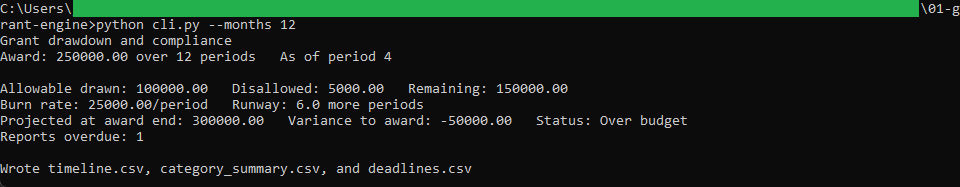
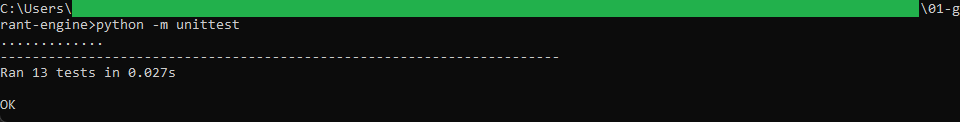
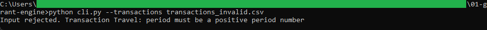

# Grant engine

A command-line tool that tracks a grant by drawdown and compliance: allowable spend
against the award period by period, the burn rate, the runway, the projection at the
award end, and the overdue reports.

## How it works

It reads `award.csv`, `transactions.csv`, and `reporting_schedule.csv`, validates all
three, and walks the award period by period. A cost is allowable only against a budgeted
category; anything else is kept out of the drawdown. It writes `timeline.csv`, which the
browser view in [../02-grant-timeline](../02-grant-timeline) reads, plus
`category_summary.csv` and `deadlines.csv`. Logic, validation, and the command-line
wrapper are in separate files, and money is computed with `decimal.Decimal` rounded half
up to the cent. It is command-line Python with the standard library only, and the full
rules are in [spec.md](spec.md).

## Running it

From this folder:

```
python -m unittest
python cli.py --months 12
```

`python cli.py` prints the position and writes the three CSV files. To see a bad file
rejected:

```
python cli.py --transactions transactions_invalid.csv
```

That file has a zero period, so the run stops with a message naming the transaction.

## In action



The engine printing the drawdown from the sample grant. By period 4 it has drawn
100,000.00 on allowable costs, kept 5,000.00 of disallowed cost out, and the 25,000.00
run rate projects 300,000.00 at the award end, 50,000.00 over, with one report overdue.



The 13 unit tests passing, covering the allowable check, the burn rate and projection,
the runway, the overdue-report count, and every validation rule.



A run against the invalid sample stopping with a clear message. A transaction with a
zero period is rejected before any drawdown is computed.
