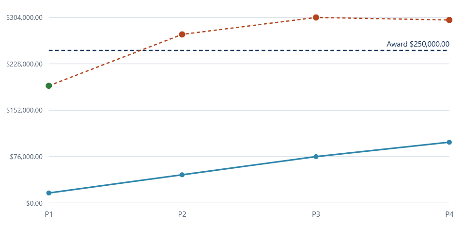
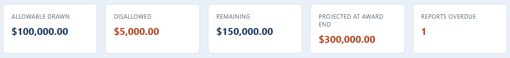
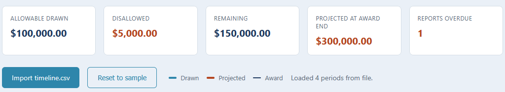

# Grant timeline view

A browser view of the grant drawdown timeline: the actual spend and the run-rate
projection against the award, a budget-versus-actual bar per category, and the reporting
deadlines.

## How it works

The view opens with the sample timeline built in and can import a fresh `timeline.csv`
from the engine. It draws an SVG chart with the actual cumulative drawdown, a dashed
projection line, and a dashed rule at the award, coloring each period by its status. The
summary cards track the drawdown, the disallowed total, the remaining award, the
projection, and the overdue reports, and the panels below show each category's spend
against its budget and each report's deadline status.

The parsing, chart geometry, and formatting live in `src/timeline.js` and mirror the
engine in [../01-grant-engine](../01-grant-engine) to the cent. It is plain HTML, CSS,
and vanilla JavaScript, opens by double-clicking `index.html`, keeps every file on your
machine, and uses no framework, no build step, and no server. Full rules are in
[spec.md](spec.md).

## Running it

Double-click `index.html` to open the view. Double-click `tests.html` to run the test
page, which checks the logic against the engine's numbers and prints PASS or FAIL with a
green count.

Import timeline.csv loads a fresh run from the engine; Reset to sample restores the
built-in timeline.

## In action

The drawdown chart. The solid line is the allowable spend drawn so far, the dashed line
is the run-rate projection, and the dashed rule is the award. The projection crosses the
award early, which is the overspend the run rate is heading for.

The headline figures: 100,000.00 drawn on allowable costs, 5,000.00 disallowed and kept
out of the drawdown, 150,000.00 remaining, a 300,000.00 projection at the award end, and
one report overdue.

The same view after importing a timeline.csv from the engine, with the status note
confirming the four periods loaded from file. The view reads the engine's own output.
