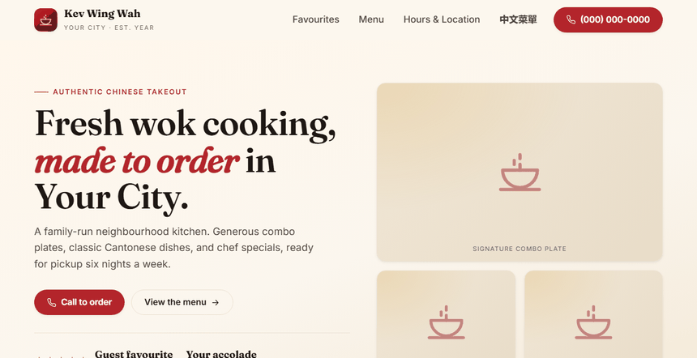
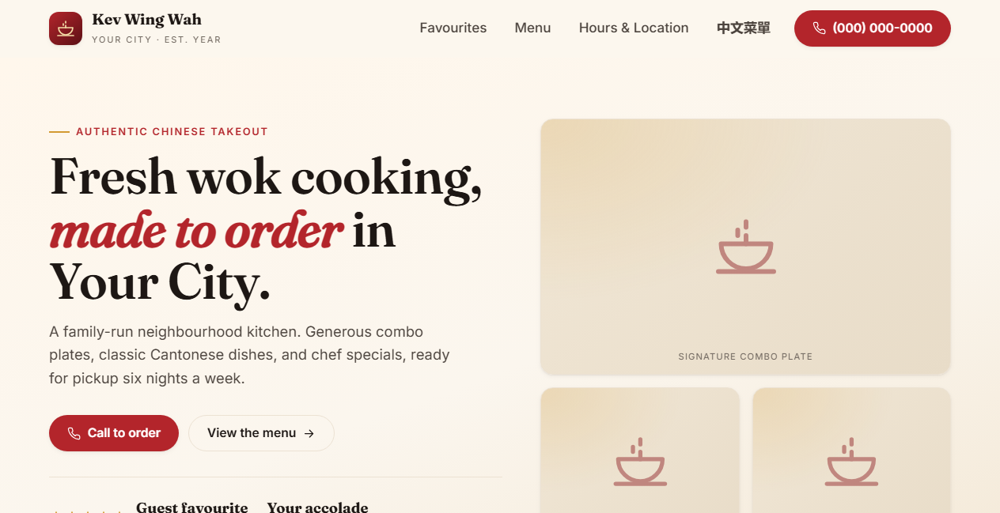
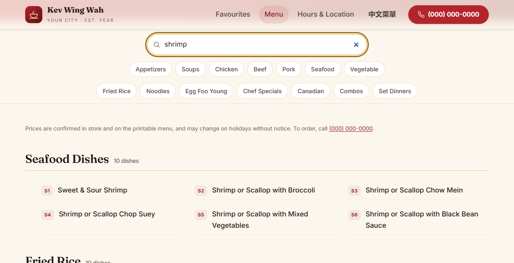
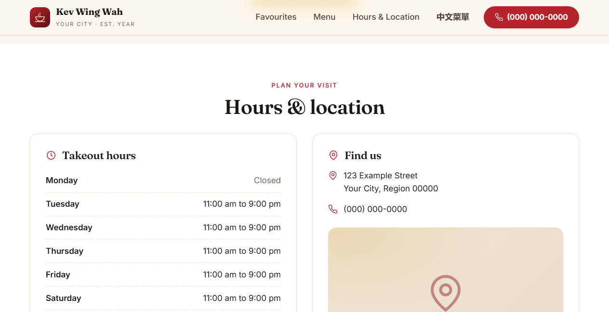
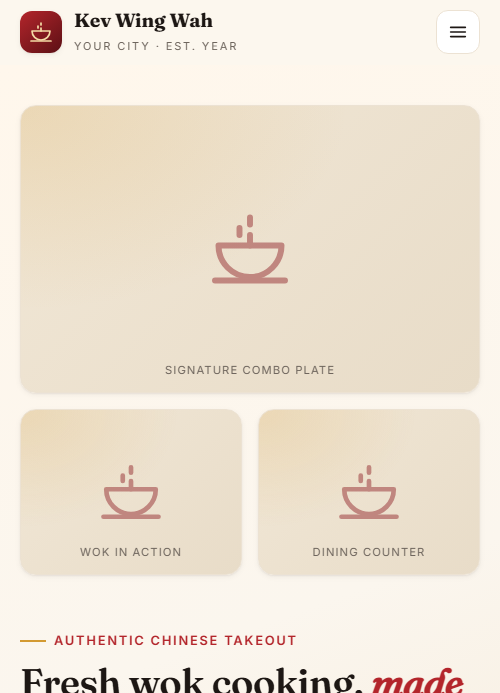
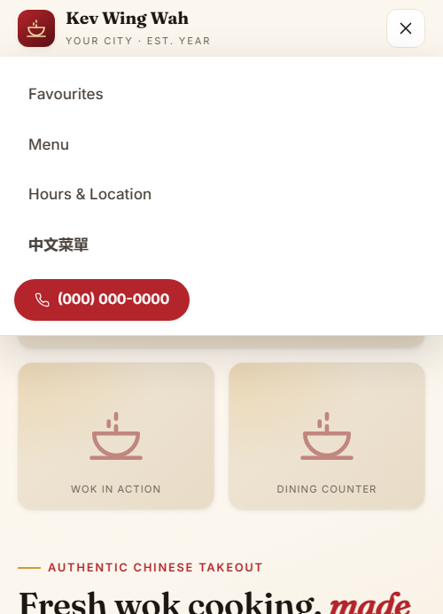

# Kev Wing Wah

A complete website for a fictional Chinese-Canadian takeout spot, built as a
reusable template. Every name, number, address, and photo is a placeholder,
so the whole thing works as a starting point for any small restaurant site.
It is plain HTML, CSS, and vanilla JavaScript: no framework, no build step,
no server. Open it in a browser and it runs.



## Running it

No install. Double-click `index.html`, or serve the folder so fonts and
relative links behave like production:

```
cd exekyute-daily-builds/miscellaneous-projects/kev-wing-wah
python -m http.server 8000
```

Then open `http://localhost:8000`.

## What it does

Three pages share one stylesheet and one small script:

- **index.html** is the whole front of house: hero, featured combos,
  customer favourites, and an hours-and-location band with tap-to-call
  buttons and a directions link.
- **menu.html** holds a 120-dish menu with live search (type "shrimp" and
  watch it filter), category chips that jump to each section, and a
  scroll-spy that highlights the category you are reading.
- **menucn.html** is a second-language menu page, wired up and ready for
  translated content.

Details I put real time into:

- Responsive from 320px up. The nav collapses to a drawer below 1024px so
  tablet portrait works, not just phones.
- Accessible: skip link, focus rings and text colours that pass WCAG AA
  contrast, live-region announcements for search results, language tagging
  on the bilingual page, and a drawer that keyboard users cannot tab into
  while it is closed.
- SEO ready: meta description, Open Graph tags, and JSON-LD structured data
  for local search, all with placeholder values marked for replacement.
- Labeled placeholder blocks where photos go, an inline SVG icon sprite,
  and an inline SVG favicon, so the template ships with zero binary assets.
- Honours `prefers-reduced-motion`.

## In action



The home page: sticky header, placeholder photo collage, and the phone
number as the main call to action.



Typing "shrimp" filters the 120 dishes down to matching sections in real
time, with the result count announced to screen readers.



Hours and location live in one band, with a map placeholder and a
directions link.



The same page at phone width: single column, hamburger nav.



The drawer menu, with the call button along for the ride.

## Making it yours

Search and replace the placeholders:

| Placeholder | Replace with |
|---|---|
| `Kev Wing Wah` | Your business name |
| `(000) 000-0000` and `tel:+10000000000` | Your phone number |
| `123 Example Street`, `Your City`, `Region`, `00000` | Your address |
| `Est. Year` | Your established year |
| Hours in `index.html` and the footers | Your real hours |
| `Guest favourite`, `Your accolade` | Your rating and any award or press |
| The maps link on the directions button | Your address or a map embed |
| `menu.pdf` on the download button | Your printable menu |
| Dish names in `menu.html` | Your menu |

Then swap each labeled placeholder block for a real `` with `width`,
`height`, `loading="lazy"`, and alt text, update the JSON-LD block so
structured data matches, and add prices if you want them shown.

## Layout

```
kev-wing-wah/
  index.html      Home: hero, combos, favourites, hours and location
  menu.html       Full menu with live search and category chips
  menucn.html     Second-language menu page
  css/styles.css  Design tokens and every component style
  js/main.js      Nav drawer, header shadow, menu search, scroll-spy
  images/         Demo GIF and screenshots
```

## License

Released under the MIT License. See [LICENSE](LICENSE).
Copyright (c) 2026 Kevin Yu (https://github.com/exekyute).
