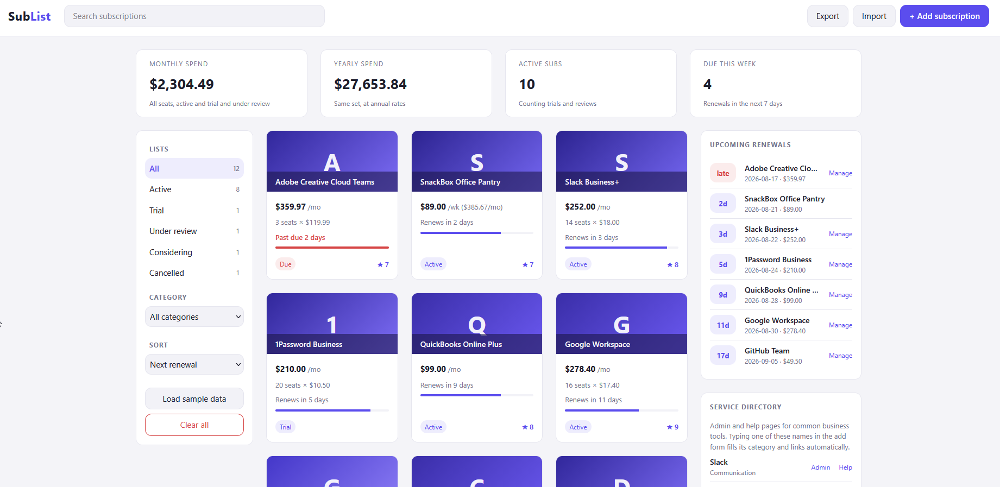

# SubList

Tracks every subscription a company pays for in one dashboard: what each tool costs across
its seats, who owns it internally, when it renews, and the date cancellation notice is due
before a renewal locks in. Cards sit in status lists (Active, Trial, Under review,
Considering, Cancelled) with a value score out of 10, so the stack reads at a glance the
way a watchlist does. Plain HTML, CSS, and vanilla JavaScript: no server, no build step,
and nothing leaves your machine.

## Quickstart

Open the folder and double-click `index.html`:

```
C:\Users\jebo\Documents\Claude Code Projects\exekyute-daily-builds\miscellaneous-projects\sublist
```

First run loads a 12-subscription sample stack (Slack, Google Workspace, Salesforce, a
trial, one renewal past due, one notice deadline coming up) so the dashboard is worth
looking at immediately. Replace it with your own tools through Add subscription, or wipe
it with Clear all in the sidebar. Everything saves to your browser's localStorage as you
go.

## In action



The sample stack on first load: $2,304.49 a month across ten countable subscriptions, the
Adobe renewal two days past due, and the next seven renewals lined up on the rail.

## The dashboard

- **Stat tiles** total monthly and yearly spend across every seat of every active, trial,
  and under-review subscription, in integer cents so the math never drifts. Every
  non-monthly contract shows its monthly equivalent on the card.
- **Cards** show the seat math (14 seats × $18.00), a renewal countdown, a progress bar
  through the billing period, and the value score. Past-due renewals and imminent notice
  deadlines flag red, and past-due sorts first.
- **Notice windows** are the company-specific part: give a subscription a 30 or 60 day
  cancellation notice period and the card warns when the deadline is inside a week, since
  that date matters more than the renewal itself.
- **Upcoming renewals** lists everything due in the next 30 days with a direct admin link
  per row.
- **The service directory** ships admin and help pages for 24 common business tools
  (Slack, Google Workspace, Salesforce, GitHub, QuickBooks, and so on). Typing one of
  those names in the add form fills its category and links automatically.
- **Clicking a card** opens the detail view: owner, seats, notice deadline, quick status
  changes, the saved links, and a Mark renewed button that rolls the date forward one
  billing cycle.

## Renewal math worth knowing

The app handles dates as plain calendar days, so time zones and daylight saving never
shift a renewal. Month-end billing keeps its anchor: a contract billed on the 31st renews
on Feb 28, then returns to Mar 31, the way card billing actually behaves. Six cycles are
supported, from weekly to every two years, prices are per seat per cycle, and rounding is
half up at the cent.

## Data, backups, and limits

Export writes the list to a JSON file; Import reads one back after validating every
record, and one bad record rejects the whole file so a broken backup can never overwrite a
good list. Older exports without seat or notice fields import cleanly with defaults.
Links must be https URLs or they are refused. Three limits worth knowing: totals assume
all prices are in one currency, there is no conversion; localStorage is per browser on one
machine, so export a backup before switching browsers or clearing site data; and many
vendor billing pages live behind a company-specific subdomain, so directory links land on
the closest stable front door.

## Testing

Double-click `tests.html` in the same folder. It runs 55 assertions against the pure logic
file (date arithmetic, leap years, month-end anchoring, seat totals, notice deadlines,
rounding, validation, import rejection) and prints a green pass count right in the page.

## Repository layout

```
sublist/
  index.html        the dashboard
  tests.html        logic test suite, 55 assertions
  css/styles.css
  js/logic.js       dates, money, validation (no DOM)
  js/services.js    the 24-service link directory
  js/app.js         rendering, storage, modals
  images/           dashboard screenshot
  LICENSE
  README.md
```

## License

Released under the MIT License. See [LICENSE](LICENSE).
Copyright (c) 2026 Kevin Yu (https://github.com/exekyute).
