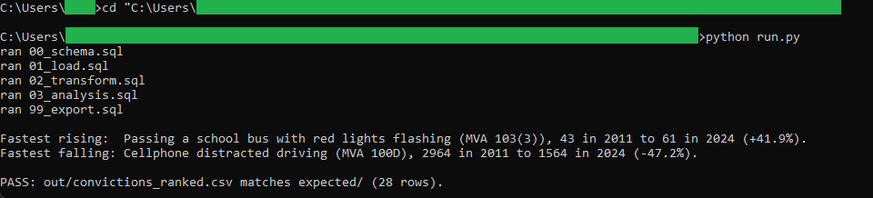
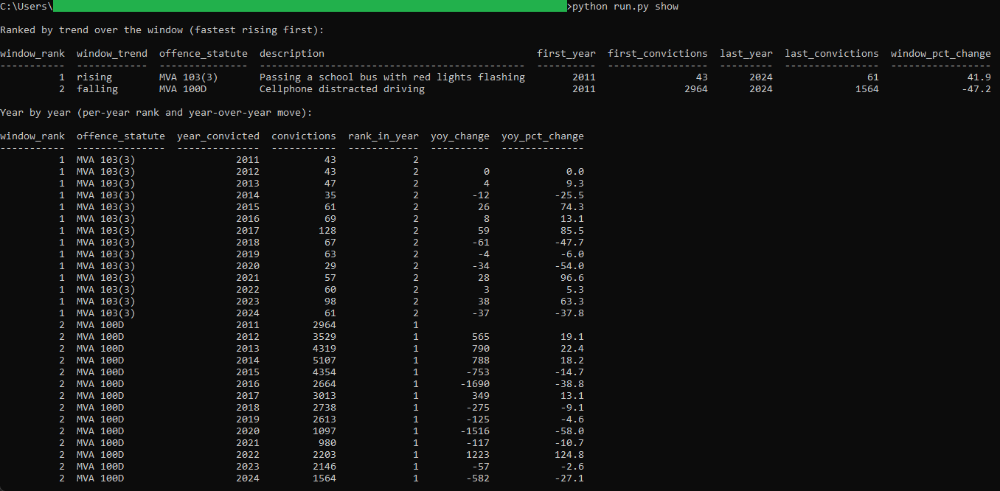

# 01: MVA conviction trend by statute

Ranks two selected Nova Scotia Motor Vehicle Act offences by conviction count each year and tracks how each one moved across 2011 to 2024. The headline: school bus passing convictions rose about 42 percent over the window while cellphone distracted-driving convictions fell about 47 percent.

## The data

Nova Scotia Open Data: **Convictions for Select MVA Offences** (`uvv7-hnbr`). Source, licence, and pull date in SOURCE.md. (Catalog idea #21.)

## What it computes

Every step is deterministic and rule-based. All logic lives in `sql/`, named by step; `run.py` holds none of it. The pipeline ranks the offences by conviction count within each year (`rank_in_year`), then walks each offence's own year sequence with `LAG` to get the year-over-year change and percent. A per-offence summary compares the first observed year to the last to label each offence rising or falling and to rank them by net percent change, so the fastest riser and fastest faller fall out of the ranking. Row order in the output is fixed, which is what makes the result reproducible.

## Testing

DuckDB is the only dependency:

    pip install duckdb

From this folder:

    python run.py            # runs the SQL end to end, then verifies
    python run.py verify     # re-runs the golden diff only
    python run.py show       # prints the ranked result as a table

`python run.py` writes out/convictions_ranked.csv, checks it against expected/convictions_ranked.csv, and prints PASS when they match row for row. `python run.py show` prints the same result as an aligned table: a per-offence trend ranking followed by the year-by-year detail. It only prints columns the SQL already produced.

## License

MIT. Copyright (c) 2026 Kevin Yu (https://github.com/exekyute).
