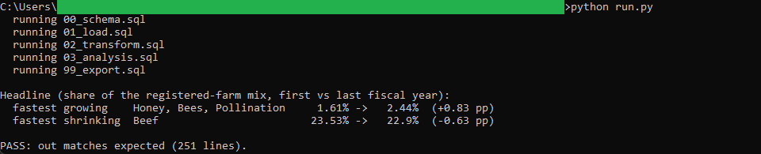
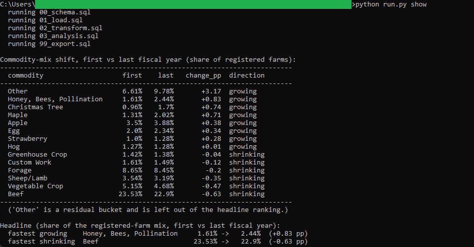

# 02: Farm commodity-mix shift

How the commodity mix of Nova Scotia's registered farms shifted across ten fiscal years, from 2015-2016 to 2024-2025. Between the first and last year, Beef stayed the largest single commodity but gave up the most share of the mix (23.53% down to 22.90%), while Honey, Bees, Pollination gained the most of any named commodity (1.61% up to 2.44%).

## The data

Nova Scotia Open Data: **Farm Registration by Commodity** (`kg43-4efs`). Source, licence, and pull date in SOURCE.md. (Catalog idea #43.)

## What it computes

Everything is deterministic and rule-based. All the logic lives in `sql/`, one file per step, and `run.py` holds none of it. The pipeline canonicalizes the commodity labels (the source spells several commodities two ways and repeats three rows in fiscal 2016-2017), counts registered farms by commodity for each fiscal year, and works out each commodity's share of that year's total. From there it computes the year-over-year change in farm counts and, over the full window, ranks which commodities gained or lost the most share of the mix. The headline names the fastest-growing and fastest-shrinking commodity between the first and last fiscal year.

## Testing

DuckDB is the only dependency:

    pip install duckdb

From this folder:

    python run.py            # runs the SQL end to end, then verifies
    python run.py verify     # re-runs the golden diff only
    python run.py show       # prints the commodity-mix shift ranking

`python run.py` writes out/commodity_mix.csv, checks it against expected/commodity_mix.csv, and prints PASS when they match row for row. `python run.py show` prints the same run and then the ranking of which commodities gained or lost the most share between the first and last fiscal year.

## License

MIT. Copyright (c) 2026 Kevin Yu (https://github.com/exekyute).
