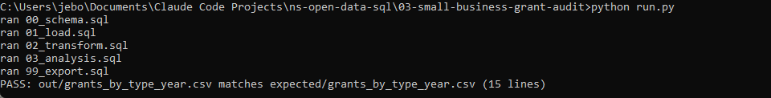
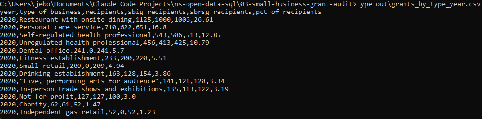

# 03: Pandemic small-business grant audit

Nova Scotia paid two COVID-era small-business grants in 2020, and this project counts the recipients by business type and year: restaurants with onsite dining top the list with 1,125 recipients, just over a quarter of everyone who received a grant.

## The data

Nova Scotia Open Data: **SBIG/SBRSG Applicants and Recipients** (`xaty-cfpq`). Source, licence, and pull date in SOURCE.md. (Catalog idea #32.)

## What it computes

Every step is deterministic and rule-based. All logic lives in sql/, named by step, and run.py holds none of it. The pipeline keeps recipients only (records that received at least one grant), then counts recipients per business type and year, splits those counts by grant (the Impact Grant and the Reopening and Support Grant), and works out each type's share of all recipients so you can see how concentrated the grants were. There is no dollar column in this dataset, so the numbers are counts of recipients, not amounts paid.

## Testing

DuckDB is the only dependency:

    pip install duckdb

From this folder:

    python run.py            # runs the SQL end to end, then verifies
    python run.py verify     # re-runs the golden diff only

`python run.py` writes out/grants_by_type_year.csv, checks it against expected/grants_by_type_year.csv, and prints PASS when they match row for row.

## License

MIT. Copyright (c) 2026 Kevin Yu (https://github.com/exekyute).
