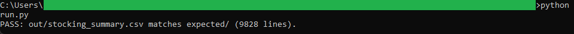
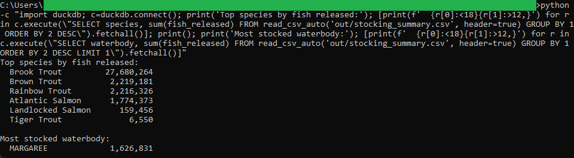

# 04 — Hatchery stocking summary

Nova Scotia hatcheries released about 34.1 million fish across 15,000 stocking events from 1976 to 2025. This project rolls those records up by waterbody, county, species, and year, and the headline is Brook Trout: 27.7 million fish, roughly four of every five released.

## The data

Nova Scotia Open Data: **Fish Hatchery Stocking Records** (`8e4a-m6fw`). Source, licence, and pull date in SOURCE.md. (Catalog idea #40.)

## What it computes

The whole thing is deterministic and rule based. Each record gets its whitespace trimmed, its year read off the stocking date, and its numbers typed, then the rows collapse into one row per county, waterbody, waterbody type, species, and year. Every group reports the number of stocking events (the effort measure), the total fish released, and the average length and weight at release. The averages skip records with no measured size, so a blank field does not read as a small fish. Sum events by year for the effort trend; sum fish released by species or waterbody for the totals behind the headline. That logic all sits in `sql/`, named by step, and `run.py` holds none of it.

## Testing

DuckDB is the only dependency:

    pip install duckdb

From this folder:

    python run.py            # runs the SQL end to end, then verifies
    python run.py verify     # re-runs the golden diff only

`python run.py` writes out/stocking_summary.csv, checks it against expected/stocking_summary.csv, and prints PASS when they match row for row.

## License

MIT. Copyright (c) 2026 Kevin Yu (https://github.com/exekyute).
